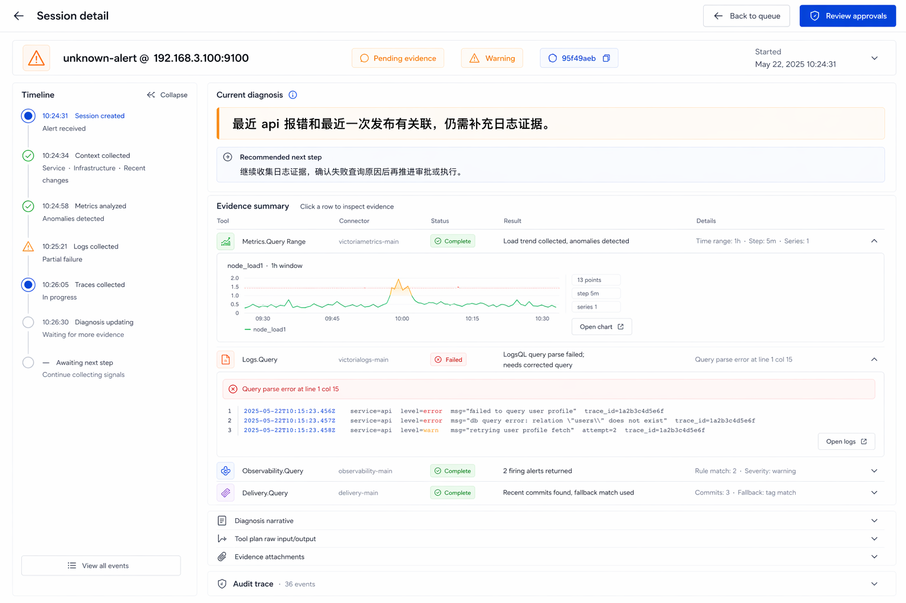
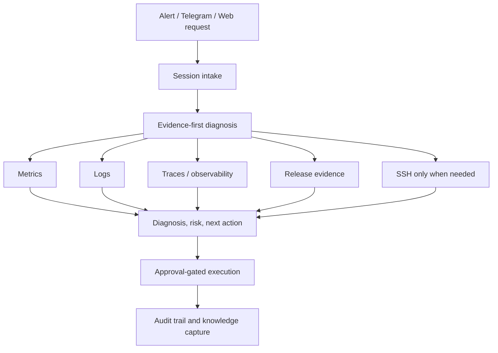

# TARS

## Hero

> Turns alerts into actionable diagnoses for on-call SRE and operations teams.
> Evidence first, human approved.

[](./go.mod)
[](./web/package.json)
[](./web/package.json)

- Focused on incident diagnosis, not another generic ops dashboard
- Puts diagnosis, evidence, risk, and next action in one flow
- Keeps approval and execution behind a human gate

## What is TARS

TARS is an AIOps MVP for on-call SRE and operations teams. It is built around a narrow job: when an alert arrives, help the responder understand what is happening and what to do next, without bouncing between metrics, logs, SSH, runbooks, and chat threads.

The product focus is not "full platform coverage." It is a tighter loop: faster diagnosis, clearer evidence, safer execution, and better auditability.

## Magic Moment

The win is not "AI wrote a long summary." The win is a responder opening one session and seeing:

1. the current diagnosis
2. the evidence behind it
3. the risk level
4. the next recommended action

That is the whole game.

## Session Detail Target Layout

The session detail page is being refocused around operator decision speed: current diagnosis, recommended next step, left-side timeline, and expandable evidence rows from the tool plan.

This image is the confirmed target information architecture reference for `/sessions/:id`. It is a design reference only, not a substitute for runtime validation in the shared environment.



## Architecture



## Quick Start

### Requirements

- Go `1.25`
- Node.js `20.19+` or `22.12+`
- npm
- Ruby
- Docker, optional

### 5-step validation path

1. Clone the repository.

```sh
git clone https://github.com/evilgaoshu/TARS.git
cd TARS
```

2. Install frontend dependencies.

```sh
make web-install
```

3. Run the publishable baseline checks.

```sh
make secret-scan
make pre-check
make check-mvp
```

4. Copy the `.example` config files into ignored local files and fill in real values outside Git.

5. If you want a local stack after the baseline checks, use the Docker Compose path described in [docs/README-notes.md](docs/README-notes.md).

If you just cloned the repo, run `make web-install` before `make check-mvp` because `check-mvp` expects `web/node_modules` to exist.

## Who is it for

TARS currently fits teams that:

- run an on-call SRE or operations rotation
- already have a real alert source such as `VMAlert`
- handle repeatable infrastructure incidents
- want AI-assisted diagnosis, but not unsupervised execution

Typical early scenarios include service unavailability, CPU or memory spikes, disk pressure, and unhealthy instances.

## Documentation

| Need | Where to start |
|------|----------------|
| Product and technical baseline | [project/README.md](project/README.md) |
| User, admin, deployment, troubleshooting guides | [docs/guides/README.md](docs/guides/README.md) |
| API, configuration, schema, compatibility | [docs/reference/README.md](docs/reference/README.md) |
| Operations, CI, rollout, deeper runbooks | [docs/operations/README.md](docs/operations/README.md) |
| Extra README notes and deeper entry links | [docs/README-notes.md](docs/README-notes.md) |

## Repository About Suggestion

If the repository owner wants to update the GitHub About section manually, this wording matches the current project scope:

- About: `AI-assisted incident diagnosis and approval-gated execution for on-call SRE teams. Turns alerts into actionable diagnoses with evidence-first workflows and human approval.`
- Topics: `aiops`, `sre`, `incident-response`, `oncall`, `observability`, `devops`, `golang`, `react`, `postgresql`, `telegram`

## Contributing

See [CONTRIBUTING.md](CONTRIBUTING.md) for local setup, development workflow, and contribution expectations.

## License

No standalone `LICENSE` file is present in the repository today. Before public release or open source distribution, add the intended license file and update this section.
