# TARS — MVP 开发任务拆解 (WBS) v1.4

> **对应 TSD**: [tars_technical_design.md](tars_technical_design.md) v1.8  
> **日期**: 2026-03-23  
> **目标范围**: Phase 1 MVP  
> **建议团队规模**: 4 人  
> **排期判断**: 4 人团队可在 4 周内可控交付；3 人团队无缓冲，高风险
> **前端拆分**: 交互层与后续 Web Console 独立任务见 [tars_frontend_tasks.md](tars_frontend_tasks.md)
> **执行跟踪**: 任务状态、测试状态、阻塞项请维护在 [tars_dev_tracker.md](tars_dev_tracker.md)

> **⚠️ 状态说明（2026-04-11 更新）**  
> 本文档已降级为**历史 WBS 基线**，不再作为当前执行排期的第一入口。  
> MVP 主体阶段基本完成；当前正在执行的高优先级主线以  
> [`docs/operations/current_high_priority_workstreams.md`](../docs/operations/current_high_priority_workstreams.md) 为准。  
> 本文档保留作回溯、架构判断和补充 DoD 定义使用。

---

## 1. 交付原则

- 先打通最短闭环，再补运维能力和硬化项
- 任何任务完成都必须对应 TSD 中的 API / Schema / 状态机 / 配置约束
- 所有跨模块联调必须以契约为准，不允许边开发边“口头约定”
- Sprint 内必须预留稳定性缓冲，不按满负荷排满 20 个工作日

## 1.1 当前阶段执行口径（2026-03-23 调整）

随着平台骨架、控制面与一级组件逐步铺开，当前阶段的优先级不再按“模块数量”线性扩展，而改为按“黄金场景闭环”收口。后续任务排期、分工与验收应遵循以下口径：

- **场景优先，而不是模块优先**：先围绕 1 到 2 条黄金场景把入口、主链、通知、审批、回执、观测、测试跑通并打磨 UX，再继续横向扩模块。
- **主场景优先**：当前第一优先场景为“告警诊断闭环”，即 `告警进入 -> 会话/证据 -> 诊断/技能 -> 审批/执行 -> 结果通知`。
- **次场景优先**：当前第二优先场景为“定时巡检闭环”，即 `自动化定时触发 -> skill / 检查任务执行 -> 结果沉淀 -> Inbox / Telegram 等通知`。
- **模块任务服从场景闭环**：新增或继续推进的模块任务，必须明确说明它直接增强了哪条场景链路；若与主场景、次场景没有直接关系，则默认降级排期。
- **UX 与信噪比优先**：当前阶段的交互优化，应优先服务主场景中的结论前置、证据可读、审批清楚、执行结果可追踪、通知不过载，而不是继续增加更多零散入口。
- **测试按场景组织**：测试回归优先沉淀成官方黄金路径与回放集，避免只做模块级单点验证，导致整体流程“组件都能跑，但场景跑不顺”。
- **暂缓原则**：对于不直接服务主场景/次场景、且不会阻塞平台地基演进的扩展项，默认进入“暂缓/后置”而不是并行铺开。
- **官方黄金路径表达层**：`sessions / executions` 的 API 与 Web Console 必须提供面向值班视角的 `golden_summary`、通知原因与下一步动作，不再只暴露原始 `diagnosis_summary` 让用户自行提炼。

## 1.2 Setup / Runtime Config 第一阶段追加任务（2026-03-23）

| ID | 任务 | 输出 | Owner | 验收 |
|----|------|------|-------|------|
| `CFG-1` | 增加 setup_state / runtime_config_documents schema | Postgres schema 与内存 fallback store | `Platform` | 空 DB 启动后自动建表成功 |
| `CFG-2` | 打通 setup wizard 最小闭环 API | `/api/v1/setup/wizard*` + `setup/status.initialization` | `Platform`,`TL/Core` | 可完成 `admin -> auth -> provider -> channel -> complete` |
| `CFG-3` | 拆分 `/setup` 与 `/runtime-checks` | 未初始化统一进入 `/setup`，初始化后运行体检迁移到 `/runtime-checks` | `Frontend` | 首次部署不需要先登录即可进入 setup，完成后进入 runtime checks |
| `CFG-4` | providers / access 第一阶段同步 DB-backed | wizard 与 providers config 写入同步到 DB | `Platform` | 重启后 setup 初始化状态与主 provider 仍可恢复 |
| `CFG-5` | 文档与回归 | PRD/TSD/WBS/Tracker/Web/deploy 文档更新，基线回归全绿 | `All` | `check_mvp/openapi/go test/web lint/web build` 全通过 |

## 1.3 Setup / Runtime Config 第二阶段追加任务（2026-03-23）

| ID | 任务 | 输出 | Owner | 验收 |
|----|------|------|-------|------|
| `CFG2-1` | manager persistence hook 收口 | `access/providers/connectors` manager 支持 DB-backed persistence hook | `Platform` | path 为空时仍可保存，且重启后可从 DB 回灌 |
| `CFG2-2` | connectors 切到 runtime DB 主路径 | connectors config + lifecycle 持久化到 `runtime_config_documents` | `Platform`,`TL/Core` | `/api/v1/config/connectors` 在无 file path 场景可用 |
| `CFG2-3` | setup provider step 强校验 | secret ref 格式/存在性 + provider connectivity check | `Platform`,`AI/Knowledge` | provider 未探活成功前不能 complete |
| `CFG2-4` | setup 完成后登录引导 | `login_hint`、自动登录、登录页预填 | `Frontend`,`Platform` | complete 后可自动登录或跳转预填 `/login` |
| `CFG2-5` | 文档与全量回归收口 | 必需文档同步 + 基线全绿 | `All` | `check_mvp/openapi/go test/web lint/web build` 全通过 |

## 1.4 黄金场景闭环收口（2026-03-25）

| ID | 任务 | 输出 | Owner | 验收 |
|----|------|------|-------|------|
| `GS-1` | Web Chat 会话收口修复 | Postgres workflow 与内存版统一支持 `web_chat / ops_api` chat-only diagnosis 自动收口 | `TL/Core`,`Platform` | `192.168.3.9` 上新建 Web Chat session 能进入 `resolved`，并触发 Inbox `session` 消息 |
| `GS-2` | Automation -> Inbox 桥接 | 在 automation run 完成/失败时复用既有 trigger/channel/inbox 主链投递通知 | `Platform` | 手动 `RunNow` 后 `/api/v1/inbox` 出现 `ref_type=automation_run` 且 `ref_id=run_id` 的消息 |
| `GS-3` | Web Chat 指纹去重收紧 | fingerprint 包含 `user + host + service + message`，避免旧 session 误复用 | `TL/Core` | 同一用户同一句话但不同 host/service 时生成不同 session |
| `GS-4` | 共享环境 observability 只读验收支撑 | fixture server + connector 默认指向只读样本接口，保证 live validation 稳定 | `Integration`,`Platform` | `scripts/ci/live-validate.sh` 在 `192.168.3.9` 返回 `live-validate=passed` |
| `GS-5` | 黄金脚本严格验收 | `run_golden_scenario_1.sh` / `run_golden_scenario_2.sh` 校验本次 session/run 的 Inbox 关联消息 | `Integration` | 两个脚本在 `192.168.3.9` 实跑均返回 `PASSED` |
| `GS-6` | Chat 默认通知切到 Inbox | `web_chat / ops_api` 诊断、策略、审批超时、直接执行结果改走 `in_app_inbox`，不再默认排队 `telegram.send` | `TL/Core`,`Platform` | 新 Web Chat 会话 `de22fbea-f887-4dbf-b7e9-553a6690ff0c` 在 `192.168.3.9` 真实进入 `resolved` 且未新增 failed outbox |
| `GS-7` | team-shared connectors runtime 基线固化 | `scripts/deploy_team_shared.sh` 部署后自动 `PUT /api/v1/config/connectors` 对齐 runtime DB state | `Platform` | 重新部署后 `observability-main` 直接保持 `base_url=http://127.0.0.1:8880`，无需手工修正 |
| `GS-8` | 历史 failed outbox 清理 | 批量删除远端遗留 `web_chat -> telegram.send -> chat not found` failed outbox | `Integration`,`Platform` | `scripts/ci/smoke-remote.sh` 在 `192.168.3.9` 返回 `failed_outbox=0 blocked_outbox=0` |

## 2. 角色划分

| 角色 | 主要职责 |
|------|----------|
| `TL/Core` | Workflow Core、状态机、事务边界、关键联调、发布把关 |
| `Platform` | 脚手架、配置、Schema、Worker、Ops API、部署与观测 |
| `AI/Knowledge` | Reasoning、脱敏、模型调用、RAG、知识沉淀 |
| `Integration` | VMAlert、Telegram、VictoriaMetrics、SSH、验收演练 |

## 3. 全局 Definition of Done

一个任务只有同时满足以下条件才算完成：

- 代码已合入主分支或处于可合并状态
- 对应配置项、迁移脚本、接口 DTO 已补齐
- 至少具备一层自动化验证：单测、集成测或契约测试
- 关键日志、指标、审计点已埋
- 文档已更新到 README / 部署说明 / OpenAPI / 配置示例中的至少一处

---

## 4. 里程碑与验收门

| 里程碑 | 时间 | 目标 | 出口标准 |
|--------|------|------|----------|
| `M0 Design Freeze` | Day 1-2 | 冻结契约和基础骨架 | OpenAPI 草案、初版 migration、样例 payload、目录结构确定 |
| `M1 Diagnosis Path` | Week 2 结束 | 打通 `VMAlert -> Session -> VM 查询 -> 模型诊断 -> Telegram` | 真实样本可跑通，重复 webhook 不产生重复 session |
| `M2 Execution Beta` | Week 3 结束 | 打通审批、SSH 执行、结果回传 | 单服务白名单内可安全执行，超时/重放/拒绝路径可用 |
| `M3 Pilot Ready` | Week 4 结束 | 打通知识沉淀、运维接口、观测、发布演练 | 完整闭环、故障注入、回滚演练通过 |

---

## 5. M0 — Design Freeze (Day 1-2)

| ID | 任务 | 输出 | Owner | 估时 | 前置 | 验收 |
|----|------|------|-------|------|------|------|
| `M0-1` | 冻结 API DTO、错误码、幂等与事务边界 | OpenAPI 草案、错误码表、接口样例 | `TL/Core` | 1d | TSD | 与 TSD §4 / §5.7 一致，无待定项 |
| `M0-2` | 冻结 PostgreSQL / SQLite-vec migration baseline | `migrations/postgres/0001_init.sql` | `Platform` | 1d | TSD | 空库可一次性建表成功 |
| `M0-3` | 准备样例数据和 golden cases | VMAlert payload、Telegram callback、诊断样例 | `Integration` | 0.5d | — | 测试样本可复用到集成测试 |
| `M0-4` | 定义 feature flags 与发布顺序 | `diagnosis_only` / `approval_beta` / `execution_beta` 配置 | `TL/Core` | 0.5d | TSD | 与 TSD §13.4 一致 |
| `M0-5` | 建立契约测试基线 | webhook/callback golden tests、OpenAPI lint | `TL/Core`,`Integration` | 0.5d | `M0-1`,`M0-3` | 后续 handler 改动能自动校验 DTO 兼容性 |

**小计**: `3.5d`

---

## 6. Sprint 1 — 告警到诊断链路 (Week 1-2)

> **目标**: 打通 `VMAlert -> AlertSession -> 查询上下文 -> AI 诊断 -> Telegram`  
> **里程碑**: `M1 Diagnosis Path`

### 6.1 平台基础与契约落地

| ID | 任务 | 输出 | Owner | 估时 | 前置 | 验收 |
|----|------|------|-------|------|------|------|
| `S1-1` | Go module、目录骨架、contracts 包 | `cmd/`, `internal/`, `contracts/` | `Platform` | 0.5d | `M0-1` | 目录与 TSD §9 一致 |
| `S1-2` | 配置加载、环境变量注入、feature flags | `internal/foundation/config/` | `Platform` | 0.5d | `S1-1` | 本地配置和环境变量覆盖可用 |
| `S1-3` | HTTP server、公共路由、中间件 | 请求 ID、recover、审计中间件 | `Platform` | 1d | `S1-1` | `/healthz`、`/readyz`、`/metrics` 可用 |
| `S1-4` | 初版 migration、repo 骨架、事务 helper | `repo/postgres`, `repo/sqlitevec` | `Platform` | 1d | `M0-2` | 空库迁移通过；repo 提供 tx wrapper |
| `S1-5` | 结构化日志、Prometheus metrics、审计基础 | `foundation/logger`, `metrics`, `audit` | `Platform` | 1d | `S1-3` | trace_id 能贯穿请求日志 |
| `S1-6` | Docker Compose、本地开发脚本 | `deploy/docker/docker-compose.yml` | `Platform` | 0.5d | `S1-4` | 一条命令可启动本地依赖 |

**小计**: `4.5d`

### 6.2 Alert Intake + Workflow 骨架

| ID | 任务 | 输出 | Owner | 估时 | 前置 | 验收 |
|----|------|------|-------|------|------|------|
| `S1-7` | VMAlert webhook handler + 签名校验 | `webhook_handler.go` | `Integration` | 1d | `S1-3` | 无效签名返回 `401 invalid_signature` |
| `S1-8` | AlertEvent 标准化、fingerprint、payload hash | `alertintake` 模块 | `Integration` | 0.5d | `S1-7` | 同样本 fingerprint 稳定 |
| `S1-9` | `idempotency_keys` 机制落地 | 幂等 repo + middleware/helper | `Platform` | 1d | `S1-4` | 重复 webhook 不重复入库 |
| `S1-10` | Workflow Core application service 与状态机骨架 | `HandleAlertEvent`, `state_machine.go` | `TL/Core` | 2d | `S1-4` | `open -> analyzing` 可推进 |
| `S1-11` | Session / session_events / outbox 基础写入 | repo + service | `TL/Core` | 1.5d | `S1-10` | 时间线和 outbox 可查询 |
| `S1-12` | 乐观锁更新 helper | version-based update | `TL/Core` | 0.5d | `S1-10` | 非法并发更新返回 `409 state_conflict` |

**小计**: `6.5d`

### 6.3 Action Gateway 查询链路

| ID | 任务 | 输出 | Owner | 估时 | 前置 | 验收 |
|----|------|------|-------|------|------|------|
| `S1-13` | VictoriaMetrics provider 接口与实现 | `provider/vm.go` | `Integration` | 1.5d | `S1-2` | 超时和错误有统一封装 |
| `S1-14` | Action Gateway query path | `QueryMetrics` | `TL/Core` | 1d | `S1-13` | Workflow 能同步拿到查询结果 |
| `S1-15` | provider 失败降级与指标埋点 | provider error model | `Integration` | 0.5d | `S1-14` | 失败不打崩主流程，有 metrics |

**小计**: `3.0d`

### 6.4 Reasoning + 基础 Knowledge

| ID | 任务 | 输出 | Owner | 估时 | 前置 | 验收 |
|----|------|------|-------|------|------|------|
| `S1-16` | 脱敏引擎与 `desense_map` 持久化 | `desensitizer.go` | `AI/Knowledge` | 2d | `S1-4` | IP/主机名可回填，secret 永不回填 |
| `S1-17` | OpenAI-compatible client + timeout/retry | `model_client.go` | `AI/Knowledge` | 1d | `S1-2` | 超时进入降级分支 |
| `S1-18` | Prompt builder + DiagnosisOutput 解析 | `prompt_builder.go`, `diagnosis.go` | `AI/Knowledge` | 2d | `S1-16`,`S1-17` | 输出 summary / citations / execution draft |
| `S1-19` | 文档导入与基础 RAG 检索 | import + sqlitevec search | `AI/Knowledge` | 2d | `S1-4` | 文档检索结果可被模型引用 |
| `S1-20` | Knowledge `Search` 契约与集成 | `KnowledgeQuery -> []KnowledgeHit` | `AI/Knowledge` | 1d | `S1-19` | Reasoning 能拿到检索命中 |

**小计**: `8.0d`

### 6.5 Telegram 诊断下发

| ID | 任务 | 输出 | Owner | 估时 | 前置 | 验收 |
|----|------|------|-------|------|------|------|
| `S1-21` | Telegram bot 初始化与发送客户端 | `bot.go` | `Integration` | 1d | `S1-2` | 能发送文本消息 |
| `S1-22` | Channel Adapter `SendMessage` 契约实现 | `channel/telegram` | `Integration` | 1d | `S1-21` | Workflow 可不感知 Telegram 细节 |
| `S1-23` | 诊断消息模板与引用展示 | formatters | `AI/Knowledge` | 0.5d | `S1-18`,`S1-22` | 消息包含诊断摘要和引用 |
| `S1-24` | Message retry via outbox | retry worker | `Platform` | 0.5d | `S1-11`,`S1-22` | 发送失败可重试 |

**小计**: `3.0d`

### 6.6 Sprint 1 验收与缓冲

| ID | 任务 | 输出 | Owner | 估时 | 前置 | 验收 |
|----|------|------|-------|------|------|------|
| `S1-25` | 单测：fingerprint / desense / state machine | `*_test.go` | `TL/Core`,`AI/Knowledge` | 1.5d | 上述任务 | 核心包覆盖关键分支 |
| `S1-26` | 契约测：VMAlert/Telegram DTO 与错误码 | contract tests | `TL/Core`,`Integration` | 0.5d | `M0-5`,`S1-24` | 关键接口不出现破坏性变更 |
| `S1-27` | 集成测：webhook -> session -> diagnosis -> Telegram | 集成测试 | `Integration` | 1d | `S1-24` | `M1` 场景可自动跑通 |
| `S1-28` | Sprint 1 缓冲与缺陷修复 | bugfix buffer | `全员` | 2d | 上述任务 | `M1` 出口标准达成 |

**小计**: `5.0d`

### Sprint 1 总计: `30.0d`

---

## 7. Sprint 2 — 审批到执行闭环 (Week 3-4)

> **目标**: 打通 `审批 -> SSH 执行 -> 验证 -> 知识沉淀 -> 运维支持`  
> **里程碑**: `M2 Execution Beta`、`M3 Pilot Ready`

### 7.1 审批交互与路由

| ID | 任务 | 输出 | Owner | 估时 | 前置 | 验收 |
|----|------|------|-------|------|------|------|
| `S2-1` | Telegram callback handler + webhook secret 校验 | `telegram_handler.go` | `Integration` | 1d | `S1-21` | 回调可安全接收 |
| `S2-2` | `telegram_update` 幂等处理 | callback dedupe | `Platform` | 1d | `S1-9`,`S2-1` | 重复 callback 不重复审批 |
| `S2-3` | `ChannelEvent` -> `HandleChannelEvent` 映射 | 审批动作映射 | `TL/Core` | 1d | `S2-1`,`S1-10` | 5 类动作都能进入 Workflow |
| `S2-4` | 审批路由实现（service owner -> oncall） | `approval_router.go` | `TL/Core` | 1d | `M0-4` | 与 TSD §7.1 一致 |
| `S2-5` | 审批模板、路由来源、SLA 展示 | Inline Keyboard + message body | `Integration` | 1d | `S2-4` | 消息展示来源和超时 |
| `S2-6` | Approval timeout worker + 升级/拒绝逻辑 | timeout worker | `Platform` | 1.5d | `S1-11`,`S2-4` | 超时后状态和通知正确 |

**小计**: `6.5d`

### 7.2 SSH 执行与风险控制

| ID | 任务 | 输出 | Owner | 估时 | 前置 | 验收 |
|----|------|------|-------|------|------|------|
| `S2-7` | SSH executor（`context.WithTimeout` + `timeout -k`） | `ssh/executor.go` | `Integration` | 2d | `S1-2` | 命令超时可中止，不留僵尸进程 |
| `S2-8` | 命令风险分级、黑名单、白名单服务约束 | `risk_classifier.go` | `TL/Core` | 1d | `S2-7` | 高风险命令无法绕过审批 |
| `S2-9` | 执行输出分块、截断、spool fallback | output writer | `Platform` | 1.5d | `S1-4`,`S2-7` | 大输出不拖垮主库 |
| `S2-10` | ExecutionResult 回传与状态推进 | Workflow 集成 | `TL/Core` | 1d | `S2-7`,`S1-10` | `approved -> executing -> completed/failed` 可走通 |

**小计**: `5.5d`

### 7.3 闭环验证与知识沉淀

| ID | 任务 | 输出 | Owner | 估时 | 前置 | 验收 |
|----|------|------|-------|------|------|------|
| `S2-11` | 验证器：`executing -> verifying` 自动检查 | verify logic | `Integration` | 1d | `S2-10` | 有明确 success/fail 判定 |
| `S2-12` | `resolved` / `failed` 路径实现 | Workflow 状态推进 | `TL/Core` | 1d | `S2-11` | `session_closed` outbox 正确落库 |
| `S2-13` | Knowledge ingest worker | `knowledge/ingest.go` | `AI/Knowledge` | 1.5d | `S2-12`,`S1-19` | 能消费 `session_closed` |
| `S2-14` | Session -> document -> chunks -> vectors 统一落库 | knowledge materialization | `AI/Knowledge` | 1.5d | `S2-13` | 重复 ingest 不重复写入 |
| `S2-15` | Execution/resolve result 消息下发 | Telegram result message | `Integration` | 0.5d | `S2-12`,`S1-22` | 成功/失败/人工接管消息完整 |

**小计**: `5.5d`

### 7.4 运维支持、发布与硬化

| ID | 任务 | 输出 | Owner | 估时 | 前置 | 验收 |
|----|------|------|-------|------|------|------|
| `S2-16` | Ops API 独立监听、Bearer Token 鉴权、审计 | `ops_handler.go` | `Platform` | 1.5d | `S1-3`,`S1-5` | 与 TSD §4.3 一致 |
| `S2-17` | `GET /sessions`、`GET /executions`、`GET /outbox`、`POST /reindex/documents` | 运维查询接口 | `Platform` | 1.5d | `S2-16`,`S2-13` | 查询和重建接口可用 |
| `S2-18` | `POST /outbox/{event_id}/replay` + 审计 | outbox 重放接口 | `Platform` | 0.5d | `S2-17` | `failed/blocked` 事件可人工恢复 |
| `S2-19` | Outbox `blocked` 状态与 feature flag 暂存策略 | dispatcher/update logic | `TL/Core`,`Platform` | 1d | `S2-18`,`M0-4` | 关闭知识沉淀开关时事件进入 `blocked` |
| `S2-20` | Idempotency GC、Execution Output GC | GC workers | `Platform` | 1d | `S1-9`,`S2-9` | 过期数据可清理 |
| `S2-21` | Feature flags + rollout mode 实现 | `diagnosis_only` 等 | `TL/Core` | 1d | `M0-4`,`S2-10` | 可动态切到只读诊断模式 |
| `S2-22` | TARS 自身 dashboard + 告警规则 | metrics dashboard | `Platform` | 1d | `S1-5`,`S2-20` | 关键指标可视化 |
| `S2-23` | 部署文档、回滚手册、试点 runbook | `docs/` | `TL/Core`,`Platform` | 1d | `S2-21` | 新环境可按文档落地 |

**小计**: `8.5d`

### 7.5 测试、演练与稳定性缓冲

| ID | 任务 | 输出 | Owner | 估时 | 前置 | 验收 |
|----|------|------|-------|------|------|------|
| `S2-24` | 单测补齐：审批路由、风险分级、幂等冲突 | `*_test.go` | `TL/Core`,`Platform` | 1.5d | 上述任务 | 关键分支有自动化验证 |
| `S2-25` | 集成测：重复 callback、输出截断、知识幂等、outbox replay | integration tests | `Integration`,`AI/Knowledge` | 2d | `S2-20` | TSD §14.2 全覆盖 |
| `S2-26` | 故障注入演练：模型超时 / VM 超时 / SSH 超时 / Telegram 重放 | 演练记录 | `全员` | 1.5d | `S2-25` | 降级和回滚路径验证通过 |
| `S2-27` | 发布检查清单与回滚演练 | release checklist | `TL/Core`,`Platform` | 0.5d | `S2-21`,`S2-26` | 开关、回滚、重放流程可演练 |
| `S2-28` | 真实样本端到端验收 | pilot report | `全员` | 1d | `S2-27` | 满足 `M3` 出口标准 |
| `S2-29` | Sprint 2 缓冲与缺陷修复 | bugfix buffer | `全员` | 2d | 上述任务 | 发布前 blocker 清零 |

**小计**: `8.5d`

### Sprint 2 总计: `35.0d`

---

## 8. 总体排期与容量

| 项目 | 人天 |
|------|------|
| `M0 Design Freeze` | `3.5d` |
| `Sprint 1` | `30.0d` |
| `Sprint 2` | `35.0d` |
| **合计** | **68.5d** |

容量判断：

| 团队规模 | 可用人天（4 周） | 结论 |
|----------|------------------|------|
| `3 人` | `60d` | 不可控，缺少约 `8.5d` 缓冲，且联调风险未计入 |
| `4 人` | `80d` | 可控，保留约 `11.5d` 风险缓冲 |
| `5 人` | `100d` | 充裕，但需防并行过度导致接口漂移 |

建议：
- 若必须 3 人交付，必须砍掉 `Ops API 写接口` 或 `Knowledge ingest` 中至少一项
- 默认按 4 人团队排期，并把多出的容量投入到演练、稳定性和试点支持

---

## 9. 关键路径

```mermaid
graph LR
    A["M0 契约冻结"] --> B["Schema + Repo + Tx Helper"]
    B --> C["Alert Intake + Workflow State Machine"]
    C --> D["VM Query + Reasoning"]
    D --> E["Telegram Diagnosis Send"]
    E --> F["Approval Callback + Router"]
    F --> G["SSH Execute + Output Store"]
    G --> H["Verify + Resolve + Outbox"]
    H --> I["Knowledge Ingest"]
    I --> J["E2E Drill + Pilot Ready"]
```

关键结论：
- `Workflow Core`、`Reasoning`、`SSH Execute` 是全链路阻塞项
- `Ops API`、`dashboard`、`GC workers` 不是关键路径，但不能拖到发布当天

---

## 10. Post-MVP 高优先级平台任务

> 以下任务不属于最初 MVP WBS，但已进入当前平台化高优先级范围。

### 10.1 Skill 平台（与 Connector Registry 同级）

| ID | 任务 | 输出 | 建议 Owner | 说明 |
|----|------|------|------------|------|
| `P4-1` | 定义 Skill Registry 数据模型与 API 契约 | Skill schema、DTO、OpenAPI 草案 | `TL/Core`,`Platform` | Skill 不再只是 draft/source，要成为一等平台对象 |
| `P4-2` | 落 Skill CRUD 与控制面 | `/api/v1/skills`、Web `/skills` 页面 | `Platform`,`Frontend` | 支持创建、查看、编辑、启用、禁用 |
| `P4-3` | 落 Skill revision / publish / rollback | revision history、promote/rollback API | `TL/Core`,`Platform` | Skill 要有版本治理，不依赖 connector 生命周期 |
| `P4-4` | 落 Skill Runtime 主路径 | planner 选 skill，runtime 展开成 tool-plan | `AI/Knowledge`,`TL/Core` | 官方 playbook 从 reasoning 硬编码切到 Skill Runtime |
| `P4-5` | Skill 审计与审核流 | audit event、review state、operator reason | `Platform`,`TL/Core` | 生成型/导入型/人工编辑型 skill 都要可追溯 |
| `P4-6` | Skill Source 与 Skill Registry 分层收口 | source import 与 installed skill 分离 | `Platform` | `skill_source` 不等于已生效 skill |

当前状态（2026-03-21）：

- `P4-1` 已完成：后端 manifest/lifecycle/DTO/discovery 已落地，OpenAPI 已补 Skill Registry API。
- `P4-2` 已完成：`/api/v1/skills` 与 Web `/skills`、`/skills/:id` 已可用。
- `P4-3` 已完成：已支持 revisions、promote、rollback、export。
- `P4-4` 已完成：dispatcher 已优先走 Skill Runtime 主路径，`disk-space-incident` 已切到 skill-first。
- `P4-5` 已基本完成：operator reason、review state、runtime mode、audit event 已落地；后续若要补更细 reviewer/workflow，可在下一阶段深化。
- `P4-6` 部分完成：import 与 installed skill 已分层，但外部 `skill_source` 同步/索引治理仍属于后续收口项。

补充（2026-03-22）：

- `P4-1A` 已完成：新增 `Extensions Manager` 最小版与 `/api/v1/extensions`，承接 `skill_bundle candidate` 治理链。
- `P4-2A` 已完成：Web `/extensions` 已提供 candidate 生成、validate、preview、review、import 入口。
- `P4-2B` 已完成：candidate 已持久化到 state file，跨重启保留。
- 后续待补：更完整 review/approval 工作流、channel/docs pack 等更多 bundle kind。

### 10.2 真实系统能力深化

| ID | 任务 | 输出 | 建议 Owner | 说明 |
|----|------|------|------------|------|
| `P4-7` | 真实 `observability.query` 接入 | 非 fixture 观测源 | `Integration` | 继续减少 fixture/stub |
| `P4-8` | 真实 `delivery.query` 接入 | 非 fixture 交付源 | `Integration` | 对接真实发布/变更系统 |
| `P4-9` | 官方 playbook 产品化 | `disk-space-incident` 等官方剧本 | `AI/Knowledge`,`Integration` | 以 Skill 为载体沉淀官方剧本 |

### 10.3 其他一级平台组件

| ID | 任务 | 输出 | 建议 Owner | 说明 |
|----|------|------|------------|------|
| `P4-10` | Provider 平台化 | Provider Registry 作为一等控制面对象 | `Platform`,`AI/Knowledge` | 补 Provider CRUD、role binding、health history、导入导出 |
| `P4-11` | Channel 平台化 | Channel Registry、多渠道配置、模板管理与通知送达能力 | `Platform`,`Integration`,`Frontend` | 站内信 / Telegram / Web Chat 先统一，后续再扩 Slack/Feishu/Voice，并补 outbound delivery |

当前状态（2026-03-23）：

- `P4-11` 已完成核心闭环：
  - `trigger.FireEvent` struct 新增 `TemplateData map[string]string`，支持通知渲染时传入变量
  - `TriggerWorker` 已注入 `*msgtpl.Manager`，`FireEvent()` 当 `trigger.TemplateID != ""` 时调用 `Render(TemplateData)` 渲染 subject/body
  - 模板未找到时 warn 日志并 fallback，不中断投递
  - `msgtpl.NewManager(db)` 已改为传入真实 PostgreSQL DB，模板从进程内存升级为持久化存储（`msg_templates` 表已落库）
  - `dispatcher.go` 已补全 skill/approval 事件接线：`on_approval_requested` 由 `runImmediateExecution()` 触发，`on_skill_completed` / `on_skill_failed` 由 `dispatchDiagnosis()` 在 skill 路径执行完成后触发
  - 当前未完成：Channel × People 精准路由深化、多渠道并发投递、Web Chat 第一方 Channel
| `P4-12` | People 平台化 | People Registry、identity unify、team/oncall mapping、profile model | `TL/Core`,`Platform` | 把审批人、值班人、owner、事实身份和动态画像统一成一等对象 |
| `P4-13` | People × Channel × Approval 联动 | 审批路由、通知、画像偏好一体化 | `TL/Core`,`Integration` | 让“谁收到什么消息、谁审批、按什么风格交互”从零散配置升级为系统能力 |
| `P4-13A` | People 动态画像 | explicit/inferred profile、confidence/source、偏好回写 | `AI/Knowledge`,`Platform` | 基于对话/行为生成更适合用户水平和偏好的回答，但不替代权限模型 |
| `P4-13B` | Trigger / Trigger Policy 统一模型 | event/state/schedule/expression 触发、通知/自动化统一绑定 | `TL/Core`,`Platform`,`Integration` | 统一 Skill / Channel / Automation 触发条件，补 dedupe/cooldown/preview/audit |
| `P4-13C` | Web Chat 第一方 Channel + 多模态能力 | `/chat`、text/image/audio 能力矩阵、平台动作调用接缝 | `Frontend`,`Platform`,`AI/Knowledge` | Web Chat 作为正式 channel，按 Channel × Provider × Policy 能力协商启用多模态，并支持受控 `platform_action` |

### 10.4 用户、认证与权限平台

| ID | 任务 | 输出 | 建议 Owner | 说明 |
|----|------|------|------------|------|
| `P4-14` | Users Platform 数据模型与 API | users/groups/identities schema、OpenAPI 草案 | `TL/Core`,`Platform` | 把平台账号从零散 identity 映射中独立出来 |
| `P4-15` | Auth Provider Registry | auth provider config model、控制面入口 | `Platform` | 支持 `local_token / oidc / oauth2 / ldap` |
| `P4-16` | OIDC / OAuth / LDAP 登录接入 | 统一登录/回调/session | `Platform` | 优先复用成熟开源库，不自研协议栈 |
| `P4-17` | 平台 RBAC 与角色绑定 | roles / bindings / permission checks | `TL/Core`,`Platform` | 覆盖平台对象和页面/API 访问 |
| `P4-18` | AuthZ 与审批边界统一 | 审批权限、平台权限、资源权限收口 | `TL/Core` | 避免审批逻辑和平台权限各自一套 |
| `P4-19` | Web 用户与权限控制面 | `/users`、`/auth`、`/roles` 基础页面 | `Frontend`,`Platform` | 至少可查看、配置和验证登录/角色状态 |
| `P4-19A` | 权限颗粒度模型标准化 | `resource/action/capability/risk` 模型、能力分级与矩阵 | `TL/Core`,`Security` | 把平台 RBAC 与 capability auth 收口到统一模型 |
| `P4-19B` | 认证增强 | 密码登录、验证码校验、2FA/MFA 基础版 | `Platform`,`Security` | 不只停留在 token/SSO，补企业级登录增强能力 |

当前状态（2026-03-22）：

- `P4-14` 基本完成：Users / Groups / Roles / Auth Providers 已具备基础数据模型、CRUD 与控制面。
- `P4-15` 基本完成：Auth Provider Registry 已落地，当前主支持 `local_token / oidc / oauth2`。
- `P4-16` 部分完成：`oidc / oauth2` redirect login、session issuance、`/me`、logout、session inventory 已落地；`ldap` 目前主要停留在 provider/config/model 层。
- `P4-17` 基本完成：平台 RBAC、角色绑定、页面/API 权限检查已具备第一版。
- `P4-18` 部分完成：平台权限与执行审批边界已开始收口，但仍有继续统一空间。
- `P4-19` 基本完成：`/identity`、`/identity/users`、`/identity/groups`、`/identity/roles` 已具备基础可用控制面。
- `P4-19B` 基础版已完成：已补 `local_password`、challenge 校验、TOTP MFA 基础链路与 `/login` 多步骤交互；企业级渠道分发、密码重置、WebAuthn/passkey 仍待后续增强。
- `CFG2-1` / `CFG2-2` / `CFG2-3` / `CFG2-4` 已完成代码主线：`access/providers/connectors` 已接 persistence hook，connectors runtime DB 主路径、setup provider 强校验、complete 后自动登录/预填登录已落地；本轮剩余重点为文档同步与全量回归。
- 2026-03-27 IA 收口补充：`/providers` 与 `/connectors` 承担日常高频对象编辑；`/identity*` 承担 IAM 日常管理；`/ops` 仅保留 raw config、import/export、diagnostics/repair、平台级高级控制与 Secrets Inventory。

### 10.5 企业级治理能力

| ID | 任务 | 输出 | 建议 Owner | 说明 |
|----|------|------|------------|------|
| `P4-20` | Organization / Workspace / Tenant 模型 | org/workspace/tenant schema 与控制面草案 | `TL/Core`,`Platform` | 多租户从 `tenant_id` 预留升级到正式组织模型 |
| `P4-21` | Identity Lifecycle / SCIM 规划与接入 | SCIM / directory sync 方案 | `Platform` | 支持目录同步、deprovision、group sync |
| `P4-22` | Secret / KMS / Encryption 平台 | secret manager / KMS / BYOK 方案 | `Platform`,`Security` | 从文件+env 注入升级到企业级密钥治理 |
| `P4-23F` | Event Bus 抽象与异步架构演进 | Publish/Subscribe/Ack/Retry/DeadLetter 抽象、outbox adapter、总线接入预留 | `TL/Core`,`Platform` | 当前继续使用 PostgreSQL outbox，先补统一异步接口，后续优先评估 NATS JetStream |
| `P4-23` | 审计合规层 | SIEM export / legal hold / retention policy | `Platform`,`Security` | 让 audit 从“可查”升级到“可合规” |
| `P4-23A` | 日志平台基础版 | runtime log schema、sink abstraction、log classes | `Platform`,`SRE` | 把运行日志、审计日志、trace、执行输出收成统一日志模型 |
| `P4-23B` | 日志检索与 Web 控制面 | `/logs`、trace/session/execution 关联检索 | `Platform`,`Frontend`,`SRE` | 让平台不仅能看 audit，还能查自身原始服务日志 |
| `P4-23C` | 内建轻量观测系统 | built-in metrics/logs/trace/event 视图与轻量 dashboard | `Platform`,`Frontend`,`SRE` | 平台自己先能看懂自己，不追求大而全 |
| `P4-23D` | OTel / 标准化观测导出 | OTLP metrics/logs/traces exporter | `Platform`,`SRE` | 用标准协议把观测能力暴露给外部系统 |

当前状态（2026-03-23）：

- `P4-20` 基础版已完成：
  - `internal/modules/org/manager.go` 已落地 `Organization / Tenant / Workspace` 正式数据模型，并支持默认 `default org / default tenant / default workspace` 单租户兼容启动路径。
  - `internal/api/http/org_handler.go` 已提供 `/api/v1/organizations`、`/api/v1/tenants`、`/api/v1/workspaces`、`/api/v1/org/context`、`/api/v1/org/policy` 等基础 API。
  - `web/src/pages/org/OrgPage.tsx` 已具备 `Organizations / Tenants / Workspaces / Policy` 基础控制面。
  - DTO/OpenAPI 与对象归属挂点（`tenant_id / workspace_id`）已补到多类平台对象契约中。
  - 当前未完成：对象级全面 tenant-aware 查询与隔离、delegated admin、跨租户治理策略、强隔离与完整企业多租户终态。
- `P4-23C` 已完成核心闭环：
  - Metrics 信号新增真实 on-disk 持久化：`RunRetention()` 每小时写一行 metrics snapshot（JSONL，含时间戳与 24h 统计指标）到 `data/observability/metrics/snapshots.jsonl`
  - `ConfigStatus().Metrics.CurrentBytes` 改用真实磁盘文件大小，`FilePath` 有真实值（`metrics/snapshots.jsonl`）；`Summary` 新增 `MetricsStorageBytes` 字段
  - `NewStore()` 自动创建 `data/observability/metrics/` 目录；metrics 文件与 logs/traces 一样纳入 retention 治理
  - Web 控制面 `ObservabilityPage.tsx` `RetentionRow` 已正确展示 `metrics/snapshots.jsonl` 文件路径
  - 当前未完成：metrics 聚合查询 API、时序数据可视化图表
- `P4-23D` 已完成最小可验证闭环：
  - `tracing.go` 完全重写：新增 `Ping(ctx) error` 方法（TCP dial 验证 OTLP endpoint 可达性），新增 `EnabledSignals() []string` 方法（返回已配置且启用的信号列表：metrics/logs/traces）
  - 新增 `insecure` 字段，与配置模型对齐
  - `Ping()` 可被健康检查和控制面用于验证 exporter 路径，不依赖外部 gRPC 包，零外部依赖
- 当前未完成：真实 OTLP gRPC/HTTP exporter 执行，仅有 TCP 可达性预检；完整 OTel SDK 接入待下一阶段
- `P4-23F` 本轮已完成基础版：
  - 已新增 `EventPublishRequest / EventEnvelope / DeliveryPolicy / DeliveryDecision` 统一契约
  - 已新增 outbox-backed adapter：内存 workflow 与 PostgreSQL store 都实现 `PublishEvent / ClaimEvents / ResolveEvent / RecoverPendingEvents`
  - dispatcher 已切到统一 delivery decision 模型，不再直接散落处理 `CompleteOutbox / MarkOutboxFailed`
  - 已覆盖 3 条真实链路：`session.analyze_requested`、`session.closed`、`telegram.send`
  - 已统一 retry/dead-letter 语义，其中 `telegram.send` 默认最多 3 次并带 backoff
  - 当前未完成：`approval_timeout`、更多 trigger/automation/extension pipeline topic 继续接入同一总线抽象
| `P4-23E` | 外部观测系统接入深化 | Prometheus/Loki/SkyWalking 等正式接入 | `Platform`,`Integration` | 保持 connector/capability 模型统一，不零散硬编码 |
| `P4-24` | Marketplace / Package Trust | signing / provenance / trust policy | `Platform` | connector/skill 外部源供应链安全 |
| `P4-25` | Session / Device / Access Hardening | session lifecycle / revoke / device inventory | `Platform`,`Security` | 企业级登录与访问硬化 |
| `P4-26` | Quota / Cost / Usage Governance | usage analytics、quota、chargeback 方案 | `Platform` | 企业运行需要成本与配额治理 |
| `P4-27` | Maintenance Window / Silence | maintenance/silence/change-window 模型 | `TL/Core`,`Integration` | 告警、审批、执行链的运维治理能力 |
| `P4-28` | Config Governance / Drift | config diff / rollback / drift detection | `Platform` | 配置中心从“可改”升级到“可治理” |
| `P4-28A` | 平台依赖管理 | dependency inventory、version/vuln/update status | `Platform`,`Security` | 把依赖、版本、漏洞从散落信息升级为平台能力 |
| `P4-28B` | 兼容性矩阵 | 第三方系统/版本兼容列表 | `Platform`,`Integration` | 统一记录 supported/verified/experimental/deprecated |
| `P4-28C` | 部署要求基线 | CPU/OS/mem/disk/net/依赖要求矩阵 | `Platform`,`SRE` | 把部署要求从 README 升级为正式交付基线 |

### 10.6 自动化测试平台化

| ID | 任务 | 输出 | 建议 Owner | 说明 |
|----|------|------|------------|------|
| `P4-29` | 测试分层与执行门槛固化 | L0-L4 测试梯度、进入/退出标准 | `TL/Core`,`Platform` | 让低能力 agent 也能按固定梯度执行测试 |
| `P4-30` | 平台组件测试矩阵 | connectors/skills/providers/channels/people/users/auth 的测试矩阵 | `TL/Core`,`Platform` | 新平台组件不再“做完才补测试” |
| `P4-31` | 共享环境验证脚本继续平台化 | live validation 子命令化、官方场景验证脚本 | `Integration`,`Platform` | 减少手工改配置和口口相传 |
| `P4-32` | Web 控制面冒烟自动化 | Playwright 或同类 UI smoke 基线 | `Frontend`,`Platform` | 让较弱 agent 也能稳定回归核心页面 |
| `P4-33` | 官方 playbook 场景回放集 | disk/release/jumpserver 等 replay data set | `AI/Knowledge`,`Integration` | 官方场景必须具备可重复回放样本 |
| `P4-34` | 安全与权限回归子集 | 审批绕过、越权、脱敏、安全规则固定回归 | `Security`,`TL/Core` | 平台化后避免功能测试掩盖安全退化 |
| `P4-35` | 测试输出模板与 review 规范 | 标准测试结论模板与 review gate | `TL/Core` | 降低普通 agent 的测试汇报质量波动 |

当前状态（2026-03-23）：

- `P4-29` 已完成：测试体系已正式收口为 `L0-L4` 五层，`make pre-check / check-mvp / full-check / deploy / smoke-remote / live-validate` 成为固定入口。
- `P4-30` 已完成第一版：平台组件测试矩阵已回写到 [30-strategy-automated-testing.md](../specs/30-strategy-automated-testing.md)，后续新增平台对象按该矩阵补测。
- `P4-31` 已完成第一版：新增 `scripts/ci/smoke-remote.sh` 与 `scripts/ci/live-validate.sh`，把共享环境 `readiness / hygiene / tool-plan live validation` 收成统一入口；`deploy_team_shared.sh` 默认串起部署闭环。
- `P4-32` 已完成第一版：Playwright 控制面 smoke 保持复用现有套件，新增 `scripts/ci/web-smoke.sh` 与 `make web-smoke` 作为统一入口。
- `P4-33` 已完成第一版：已新增 `deploy/pilot/golden_path_alert_v1.json`、`deploy/pilot/golden_path_telegram_callback_v1.json` 与 `scripts/run_golden_path_replay.sh`，把黄金告警诊断闭环收敛成固定回放入口；后续继续扩展 `disk-space-incident / release / jumpserver` 等更多官方样本。
- `P4-34` 部分完成：当前已有 capability `202/403`、auth 增强与共享环境授权路径 live validation，但越权/脱敏/审批绕过仍需补成固定回归子集。
- `P4-35` 已完成第一版：测试输出模板、执行门槛与 review 规则已在测试策略文档中固化，便于弱 agent 直接按模板汇报。

### 10.7 Agent Role 平台化

| ID | 任务 | 输出 | 建议 Owner | 说明 |
|----|------|------|------------|------|
| `P4-36` | Agent Role 后端模块实现 | `internal/modules/agentrole/` manager、registry、lifecycle、DTO | `TL/Core`,`Platform` | Agent Role 作为一等平台对象，支持 CRUD、enable/disable、lifecycle 管理 |
| `P4-37` | Agent Role API 契约与路由 | `/api/v1/agent-roles` 全套 CRUD + lifecycle endpoints | `Platform` | 提供 list/get/create/update/enable/disable/delete API，统一鉴权与审计 |
| `P4-38` | Agent Role 前端控制面页面 | `/agent-roles` 列表页 + `/agent-roles/:id` 详情页 | `Frontend`,`Platform` | 支持列表检索、详情查看、创建、编辑、启停操作 |
| `P4-39` | Agent Role OpenAPI 契约同步 | `api/openapi/tars-mvp.yaml` 补齐 Agent Role 相关 path 与 schema | `Platform` | 保持 OpenAPI 与实现一致，通过 `validate_openapi.rb` 校验 |
| `P4-40` | Agent Role struct hooks 与平台集成 | Agent Role 与 workflow/dispatcher/session 的 struct hooks 接线 | `TL/Core`,`Platform` | Agent Role 绑定到会话上下文，影响诊断策略、审批路由、执行边界等运行时行为 |

当前状态（2026-03-25）：

- `P4-36` 已完成：后端 `internal/modules/agentrole/` 已落地，包含 manager、registry、lifecycle、DTO 与持久化。
- `P4-37` 已完成：`/api/v1/agent-roles` 全套 CRUD 与 lifecycle API 已可用，鉴权与审计已接入。
- `P4-38` 已完成：Web `/agent-roles` 列表页与 `/agent-roles/:id` 详情页已落地，支持创建、编辑、启停。
- `P4-39` 已完成：OpenAPI schema 已同步补齐 Agent Role 相关 path 与 schema 定义。
- `P4-40` 已完成：Agent Role struct hooks 已接入 workflow/dispatcher/session 上下文，可影响运行时行为。
- `P4-41` 已完成：SystemPrompt 注入——Dispatcher 在 `dispatchDiagnosis()` 中根据 AgentRole 注入 `agent_role_system_prompt`，Reasoning 的 `buildFromModel()` 自动将其前置到系统提示词。
- `P4-42` 已完成：Auto-assign agent_role_id——工作流 session 创建时（in-memory 和 Postgres 两条路径）默认赋值 `diagnosis` 角色。
- `P4-43` 已完成：Authorization 执行层叠加——`agentrole.EnforcePolicy()` 在 `resolveAuthorizationDecision()` 之上叠加 AgentRole 的 PolicyBinding 约束，取最严格结果。
- `P4-44` 已完成：Automation UI agent_role_id 下拉——AutomationsPage.tsx Advanced 区新增 Agent Role 下拉选择器，支持为自动化任务指定运行角色。
- `P4-45` 已完成：Postgres 持久化——`agent_roles` 表 DDL、`alert_sessions`/`execution_requests` 新增 `agent_role_id` 列，SELECT/INSERT 同步更新。
- `P4-46` 已完成：Skills 类型补齐——`skills.Metadata` 新增 `Version`、`skills.Spec` 新增 `Type`/`Triggers`/`Planner`，`Expand()` 重实现，`matchesManifest()` 增强，DTO 与 handler 映射同步。

---

## 10. 下一阶段高优先级（2026-03-19）

在 MVP 与连接器平台第一阶段完成后，当前最应该优先推进的不是新增更多系统，而是把诊断范式从“固定 enrich”升级到“tool-plan 驱动”。

### 10.1 Priority A — Tool-plan 驱动诊断

| ID | 任务 | 输出 | Owner | 估时 | 前置 | 验收 |
|----|------|------|-------|------|------|------|
| `P3-1` | 扩展 `DiagnosisOutput` 支持 `tool_plan` | diagnosis DTO / parser | `AI/Knowledge`,`TL/Core` | 1d | 当前 MVP 基线 | LLM 可返回 `summary + tool_plan + execution_hint` |
| `P3-2` | 新增 tool-plan executor | workflow / action orchestration | `TL/Core` | 2d | `P3-1` | 只读 plan 可被平台执行并回写 trace |
| `P3-3` | 让 diagnosis 从“固定 enrich”切到“先 plan 后调用” | dispatcher / workflow 调整 | `TL/Core`,`AI/Knowledge` | 2d | `P3-2` | 不再无条件固定查一次基础 metrics |

> ✅ `P3-1` / `P3-2` / `P3-3` 已全部完成。diagnosis 主链路已切为 `planner -> execute tool steps -> final summarizer`；`observability.query` / `delivery.query` / `connector.invoke_capability` 已实现为真实执行路径，统一走 Capability Runtime。

### 10.2 Priority A — Metrics Range Query

| ID | 任务 | 输出 | Owner | 估时 | 前置 | 验收 |
|----|------|------|-------|------|------|------|
| `P3-4` | 扩展 `MetricsQuery` 支持 `query_type/start/end/step/window` | contracts / DTO / OpenAPI | `TL/Core`,`Platform` | 1d | `P3-1` | API 与运行时支持 range query 参数 |
| `P3-5` | `Prometheus / VictoriaMetrics` range query runtime | connector runtime | `Integration` | 2d | `P3-4` | 可返回过去一小时等时间窗口数据 |
| `P3-6` | 用 tool-plan 驱动监控优先回答 | reasoning prompt + executor policy | `AI/Knowledge`,`Integration` | 1d | `P3-5` | “过去一小时负载”优先命中 metrics range query，而不是直接生成主机命令 |

### 10.3 Priority A — 媒体附件协议

| ID | 任务 | 输出 | Owner | 估时 | 前置 | 验收 |
|----|------|------|-------|------|------|------|
| `P3-7` | 扩展 `ChannelMessage` 支持 `attachments[]` | contracts / channel DTO | `TL/Core`,`Platform` | 1d | `P3-4` | 消息支持 image/file 附件 |
| `P3-8` | Telegram / Web 支持图片和文件结果 | channel runtime / frontend wiring | `Integration`,`Frontend` | 2d | `P3-7` | 可发送图表 PNG 和报告文件 |
| `P3-9` | 生成监控图表与下载文件 | chart rendering / file export | `Platform`,`Integration` | 2d | `P3-5`,`P3-7` | 用户可收到过去一小时负载图片或文件 |

说明：

- `APM / CI-CD / Git / MCP Source` 继续重要，但排在这组能力之后
- 这组任务的目标是先让系统具备“先查监控，再决定是否执行，并能返回图表”的真实运维体验

---

## 10. 风险与应对

| 风险 | 表现 | 应对 |
|------|------|------|
| 契约漂移 | handler、service、repo 各自定义 DTO | `M0` 冻结契约，所有变更先改 TSD/OpenAPI |
| 模型输出不稳定 | 诊断结构化失败、命令不可执行 | 引入 mock 响应、解析兜底、只对白名单执行 |
| 外部依赖波动 | VM / Telegram / model 不稳定 | 通过 feature flags 退回 `diagnosis_only` |
| 人天排满无缓冲 | Sprint 尾部堆积联调 bug | 每个 Sprint 预留显式缓冲，不再压满 |
| 3 人并行过少 | 核心链路和集成任务互相堵塞 | 建议 4 人；若仅 3 人则砍范围 |

---

## 11. 建议的并行分工

| 角色 | Week 1 | Week 2 | Week 3 | Week 4 |
|------|--------|--------|--------|--------|
| `TL/Core` | Workflow 骨架、状态机、事务规则 | Workflow 联调、查询接入 | 审批路由、状态推进 | 发布把关、演练、验收 |
| `Platform` | 配置、迁移、repo、metrics | 幂等、outbox、retry | Ops API、GC、flags | dashboard、回滚、文档 |
| `AI/Knowledge` | 脱敏、模型 client | prompt、RAG、diagnosis | ingest、materialization | 故障注入、试点支持 |
| `Integration` | VMAlert、Telegram send | M1 联调、样本维护 | callback、SSH executor | E2E、真实环境联调 |

---

*本任务拆解基于 [tars_technical_design.md](tars_technical_design.md) v1.4。若 TSD 中的 API、Schema、事务边界或发布策略变更，必须同步更新本 WBS。*

---

## 12. Post-MVP Backlog

> 以下内容不阻塞当前 MVP 试点，但已明确进入下一阶段产品化范围。

### 12.1 外部系统集成框架

| 方向 | 目标系统 | 目标能力 |
|------|----------|----------|
| `ExecutionProvider` | `SSH`、`JumpServer` | 执行命令、读取主机状态、统一审批与审计 |
| `MetricsProvider` | `VictoriaMetrics`、`Prometheus` | 查询指标、趋势、历史窗口，辅助告警分析 |
| `ObservabilityProvider` | APM / tracing / logging | 查询 trace、span、错误、日志上下文 |
| `DeliveryProvider` | `Git`、CI/CD、发布系统 | 查询变更、流水线状态、最近发布 |

任务原则：

- 优先补“查询外部系统拿上下文”，不是优先 SSH 上机
- 新接入的执行/发布系统不能绕过授权策略和审批链
- Provider Registry 长期要从“模型注册表”扩展成“统一连接器注册表”
- 具体接入方法与可行性评估见 [docs/30-strategy-third-party-integration.md](../specs/30-strategy-third-party-integration.md)

### 12.2 连接器平台与插件市场

| 方向 | 目标 | 关键输出 |
|------|------|----------|
| `Connector Registry` | 用统一清单管理外部系统接入 | discovery API、manifest schema、registry 存储 |
| `Connector Marketplace` | 支持官方/第三方连接器导入导出 | marketplace package、导入导出流程、版本兼容校验 |
| `MCP / Skill Source` | 收敛 MCP server 与 Skill 外部源 | source registry、导入策略、授权边界 |

任务原则：

- discovery 接口必须公开且稳定，便于外部系统主动发现 TARS 接入能力
- 新连接器必须通过 manifest 描述能力、兼容版本和导入导出能力
- 对接上游系统大版本升级时，应优先通过 marketplace package 或 manifest 完成迁移
- 插件市场不应绕开授权、审批、审计控制面

当前已实现：`connector.invoke_capability` 统一能力调用入口（HTTP + tool plan step）、Capability Runtime 接口与 stub runtime 注册、`invocable` 能力标记、能力级授权（`EvaluateCapability`）。

### 12.3 多记录列表统一框架

适用范围：

- `sessions`
- `executions`
- `outbox`
- `audit`
- `knowledge trace`

必须统一支持：

- 分页
- 搜索
- limit
- 排序
- 批量操作

任务原则：

- 前后端使用统一查询参数约定，不按页面各自发明
- 列表页面复用统一状态、筛选、批量动作组件
- 批量操作至少覆盖 replay / delete / mark handled / rebuild 这类运维动作

### 12.4 平台配置导出导入

| 方向 | 目标 | 关键输出 |
|------|------|----------|
| `Platform Bundle` | 支持全量平台配置导出导入 | bundle schema、manifest、diff/preview、import report |
| `Module Export/Import` | 支持单模块迁移与恢复 | connectors/skills/providers/channels/people/users 等模块导入导出 |
| `Secret Handling` | 控制 bundle 中 secret 的处理方式 | `refs_only / redacted / explicit bundle` 策略 |

任务原则：

- 导出导入必须通过平台对象模型，不直接依赖手工文件拷贝
- import 必须支持 validate / preview / selective apply
- secret 明文不得默认导出

### 12.5 平台自动化 / 定时任务

| 方向 | 目标 | 关键输出 |
|------|------|----------|
| `Automation Registry` | 管理定时任务和自动化作业 | jobs、schedules、run history |
| `Scheduled Skill` | 让 skill 可按计划执行 | skill-based jobs、run records、审批边界 |
| `Platform Actions` | 定时执行平台动作 | reindex/export/health check/backup 等动作 |

任务原则：

- 自动化不应只是零散 cron 或 worker
- 高风险自动化不得绕过审批
- skill / connector capability / platform action 需要统一进入 automation runtime

补充当前进度（2026-03-22）：

- 已落地基础版 `Automation Registry`
  - `/api/v1/automations`
  - `/automations`
  - create / edit / enable / disable / run now
  - job state / run history / audit
- 已落地首批对象：
  - `skill`
  - `connector_capability`
- 当前未落地：
  - `platform_action`
  - `tool_plan_template`
  - automation delete/export/import
  - schedule 与完整 workflow approval session 的主链衔接

补充当前进度（2026-03-23 控制面收口第一批）：

- `Automation Jobs` 页面已补失败态摘要、due soon 摘要、最近 scheduler error 展示
- JSON 输入从“静默吞错后回 `{}`”修正为前端显式校验失败
- `Groups` 页面已补 enable / disable
- `Connectors` detail 已接上 export / upgrade / rollback / capability invoke
- `Org Policy` 页面已补 tenant policy 可编辑闭环
- `Msg Templates` 已把 `Test Send` 明确收口为 preview-first，而非伪造可用后端动作

下一步建议收口到：

1. `platform_action` runtime
2. 高风险 schedule 的 workflow approval integration
3. 统一 `Trigger / Trigger Policy`

### 12.6 Skill 驱动的平台对象自动创建

| 方向 | 目标 | 关键输出 |
|------|------|----------|
| `Platform Actions` | 让 skill 能通过正式平台 API 创建/更新对象 | channels/providers/people/skills/connectors 的平台动作 |
| `Controlled Mutations` | 自动创建过程可审计、可预览、可审批 | dry-run、validate、approval、audit |

任务原则：

- Skill 可以自动化编排创建对象，但不能直接写底层配置文件
- Registry / Platform API 才是真正的治理落点
- 先支持低风险对象，再扩展到高风险对象

### 12.6A 受控自进化 / 自扩展

| 方向 | 目标 | 关键输出 |
|------|------|----------|
| `Extension Bundle` | 统一承载系统生成的新扩展 | bundle schema、kind/version、compatibility、docs、tests |
| `Builder Pipeline` | 让 Skill 生成的扩展草稿进入标准治理链 | validate、compatibility check、security check、automated tests、review、import |
| `Generated Docs` | 新扩展自动补齐用户/管理员/配置文档 | docs pack、docs center 接入、publish/rollback |
| `Controlled Upgrade` | 让低风险扩展支持后续升级/回滚 | upgrade plan、rollback plan、import/upgrade audit |

任务原则：

- 不把“自进化”做成模型直接修改核心源码
- 先让系统生成候选扩展，再由平台治理链决定是否生效
- 生成对象优先覆盖 connector/channel/provider/auth provider/skill/docs

补充当前阶段 DoD：

- `/identity` 作为 IAM overview
- `/identity/providers` / `/identity/users` / `/identity/groups` / `/identity/roles` 可用
- `/api/v1/auth/sessions`、`/api/v1/me`、真实 OIDC/OAuth redirect path 可验证
- 仅 `/identity/users`、`/identity/groups`、`/identity/roles`、`/identity/people`、`/identity/providers` 这 5 个 IAM 日常页不要求前端显式填写 `operator_reason`；`/providers`、`/connectors` 等其他对象页仍以各自 API 契约为准
- 生成出来的扩展必须可导入、可测试、可升级、可回滚

### 12.7 Web Console 全局体验平台化

| 方向 | 目标 | 关键输出 |
|------|------|----------|
| `Theme System` | 支持白天 / 黑夜 / 跟随系统 | 全局主题状态、持久化、图表/状态色统一响应 |
| `Docs Center` | 支持系统内置文档中心 | 顶部右上角 docs 入口、用户手册/管理员手册内置访问与搜索 |
| `I18N` | 支持中英文切换 | `zh-CN / en-US` 字典、全局语言状态、关键页面国际化 |
| `Message Templates` | 支持消息模板自定义 | 诊断/审批/执行结果模板、预览、测试发送 |

任务原则：

- 主题、语言、文档中心属于 Web Shell 能力，不应散落在单页里各自实现
- 文档中心优先使用系统自带文档，不依赖外部站点才能使用
- 主题切换不应只切背景色，必须覆盖图表、状态色、弹窗和详情页

---

## 13. 安全与权限回归护栏（已落地，2026-03-27）

### 背景

平台化后，关键安全边界（越权访问、审批绕过、脱敏退化、高风险能力误暴露、API 权限不一致）存在因代码变更静默退化的风险。本任务建立固定、可重复、可回归的安全验证护栏，并让较弱 agent 后续也能按固定入口执行这组验证。

### DoD

- [x] 固定回归子集落地：15 个测试覆盖 6 大安全边界
- [x] 可重复执行入口：`make security-regression`（L2，~3s）
- [x] CI 脚本：`scripts/ci/security-regression.sh`
- [x] 文档同步：`30-strategy-automated-testing.md`、`20-component-identity-access.md`、`30-strategy-authorization-granularity.md`、`30-strategy-command-authorization.md`、`30-strategy-desensitization.md`
- [x] 验收全绿：`go test ./...` ✅、`bash scripts/check_mvp.sh` ✅

### 覆盖的安全边界

| 类别 | 测试数 | 关键场景 |
|------|--------|----------|
| 未认证访问矩阵 | 2 | 17 受保护端点 + 7 写端点，无 token → 401 |
| Viewer RBAC 越权 | 3 | 写配置/触发 automation/写 connector → 403 |
| 账号禁用即失效 | 1 | disabled user session → 401 |
| Break-glass/ops-token 边界 | 2 | OpsAPI disabled → 失效；enabled → 完整权限 |
| 配置脱敏 | 1 | 配置 API 不暴露明文 secret 前缀 |
| 审批端点保护 | 2 | approve 无 token → 401；viewer → 403/404 |
| Automation/Webhook trigger | 2 | 无 token → 401；配置 secret → 强制验签 |
| 无效 token 格式 | 1 | 5 种畸形 token → 401 |
| 公开端点白名单 | 1 | 5 个公开端点无 token 可访问 |

### 关键文件

- `internal/api/http/security_regression_test.go` — 15 个安全回归测试
- `scripts/ci/security-regression.sh` — CI 专项脚本
- `Makefile` — `make security-regression` target
