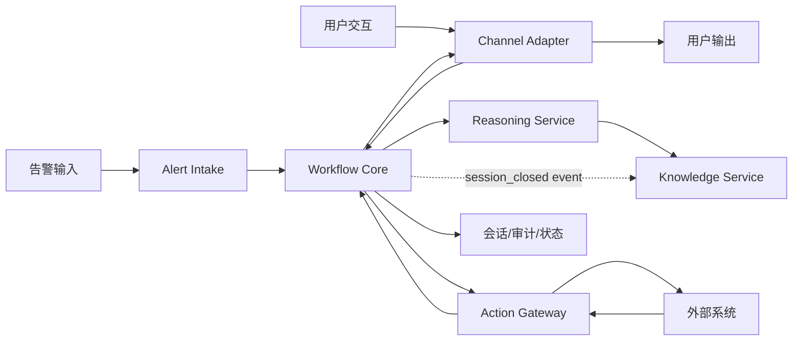
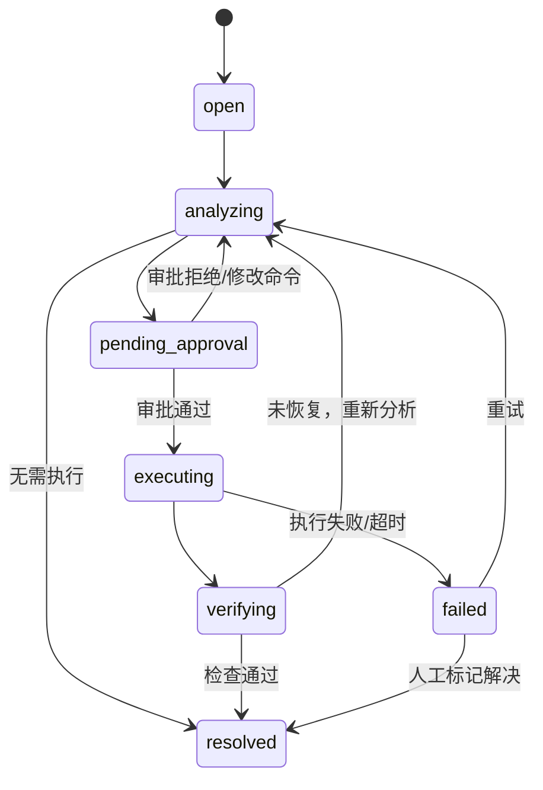

# TARS — 产品需求文档 (PRD) v2.6

> **版本**: v2.6  
> **日期**: 2026-03-19  
> **状态**: 待评审（试点客户与审批规则补充版）

---

> **⚠️ 当前适用范围说明（2026-04-11 更新）**
>
> 本文档 §1–§7 仍是当前主线的产品基线，适用于 MVP 阶段和试点可持续使用阶段。  
> **§8 迭代规划中的 Phase 2b / Phase 3 / Phase 4 为后续规划，当前不是执行优先级；§9 以后更多作为参考与评审附件，不作为当前排期入口。**  
> 正在执行的优先级以 [`docs/operations/current_high_priority_workstreams.md`](../docs/operations/current_high_priority_workstreams.md) 为准。  
> 前端欠账与打磨优先级以 [`docs/operations/spec_focus_review_2026-04-11.md`](../docs/operations/spec_focus_review_2026-04-11.md) 为准。

---

## 1. 产品定位

**TARS 是一个面向告警分析与受控执行的 AIOps 智能运维助手。**

TARS 的目标不是做一个“大而全”的可观测平台，也不是通用 Agent 平台，而是围绕一条明确主线提供价值：

**告警进入 -> 自动收集上下文 -> AI 给出诊断建议 -> 人工审批 -> 受控执行 -> 回传结果 -> 沉淀经验**

### 1.1 核心价值

| 价值 | 说明 |
|------|------|
| 降低 MTTR | 自动收集指标和知识上下文，缩短从告警到诊断建议的时间 |
| 保持可控 | 命令执行必须经过人工审批，审计完整可追溯 |
| 形成复用 | 将闭环记录沉淀为知识和 Skill 草稿，为后续复用做准备 |

### 1.2 目标用户与场景优先级

| 角色 | 优先级 | 核心场景 | 关注点 |
|------|--------|----------|--------|
| 值班 SRE / 运维工程师 | P0 | 收到告警后快速获得诊断建议并推进处置 | 首个建议速度、查询准确性、执行是否顺手 |
| 运维负责人 / 审批人 | P0 | 对执行风险进行人工把关 | 审批链路清楚、风险分级合理、审计可追溯 |
| 平台管理员 | P1 | 部署系统、配置模型/渠道/插件、查看运行状态 | 部署简单、配置收敛、系统稳定 |
| 知识管理员 | P1 | 管理文档和 Skill 草稿，并负责审核生效 | 知识沉淀、引用准确、审核标准清晰 |

> 产品主用户是 `值班 SRE / 运维工程师`，主决策人是 `运维负责人 / 审批人`。MVP 的功能优先级以这两类用户的闭环效率为准，而不是以后台能力完备度为准。

### 1.2.1 Setup Wizard 第一阶段口径（2026-03-23）

- 首次部署时，`/setup` 作为唯一的首次安装入口。
- 第一阶段最小闭环要求系统能识别“未初始化”状态，并引导用户依次完成：`首个管理员 -> 最小登录方式 -> 主模型 -> 默认通知渠道`。
- 初始化完成后，运行体检能力迁移到受保护的 `/runtime-checks`，不再和首次安装共用同一路由。
- 启动层仍保留 env：`DB DSN`、监听地址、`public/base URL`、`web dist` 路径、secret backend、spool/retention/本地路径，以及可选 bootstrap admin 初始凭据。
- 运行时平台配置从本阶段开始逐步切向 DB-backed；优先收口 `providers`、`auth providers`、`channels`、`setup 初始化状态`，secret 继续通过 `secret ref / secret store` 管理，不直接落普通配置表。

### 1.2.2 Setup Wizard 第二阶段口径（2026-03-23）

- 第二阶段继续把 `connectors` 纳入 DB-backed runtime config 主路径，避免 `/config/connectors` 与 registry 能力继续被 file path 绑定。
- `auth providers`、`channels` 与 `首个管理员` 的首次安装结果继续通过 runtime DB 持久化，并由运行时 manager 直接从 DB 回灌，不再依赖“必须存在 YAML path”。
- setup provider 步骤不再只做静态保存，而必须先完成两类前置检查：
  - `secret ref` 格式与存在性校验
  - provider connectivity / availability check
- setup complete 后要给出明确登录引导；若当前选择的是 `local_password` 且仍持有刚录入的密码，则优先自动完成一次登录引导，否则至少跳转到带预填用户名/provider 的登录页。

### 1.3 非目标

- 不做通用可观测平台，不负责替代 Prometheus、VictoriaMetrics、Loki、Jaeger。
- 不做完整 ITSM 平台，MVP 不覆盖复杂工单流、SLA、跨团队协作。
- 不做通用 Agent 编排，不支持任意工具自治调用。
- 不做自动执行闭环，任何写操作都不能绕过人工审批。
- 不做多渠道全量铺开，MVP 只保留一个主渠道。
- 不做多生态大而全接入，MVP 只支持最小南向集成。

### 1.4 试点客户画像与验证方案

| 项目 | 定义 |
|------|------|
| 试点团队画像 | 5-15 人值班 SRE / 运维团队，以 VMAlert + 主机 / 容器告警为主，已有 Telegram 值班群，能接受公网模型带来的效率收益 |
| 告警规模 | 日均 20-100 条告警，其中高频为 CPU、内存、磁盘、服务不可用、实例异常 |
| 技术环境 | 已有 VictoriaMetrics；目标主机可通过 SSH 访问；具备基础 Runbook 或故障文档；允许通过 OpenAI-compatible 接口访问公网模型 |
| 当前痛点 | 告警进来后靠人工查图、查机、查文档，建议产出慢；审批和执行缺少统一审计 |
| 试点周期 | 2-4 周 |
| 试点目标 | 验证 TARS 能否借助公网模型缩短首个诊断建议时间，并让审批和执行链路可追溯 |

**试点准入条件**
- 试点团队同意将一类标准化告警接入 TARS，且告警链路稳定。
- 至少有 1 名审批人和 2 名实际值班用户参与试点。
- 允许提供 3-5 份 Runbook / SOP 作为 MVP 文档知识源。
- 团队接受在脱敏前提下使用公网模型，不将“完全内网闭环”作为首期阻塞条件。

**试点成功标准**
- 至少完成 20 个真实告警会话样本。
- 关键业务指标达到 [7.5 MVP 业务指标](#75-mvp-业务指标) 中定义的目标，或明显优于试点前基线。
- 试点结束后 2 周内，用户主动触发 ≥ 10 个新会话（证明愿意继续使用，而非退回纯手工流程）。

---

## 2. 高层视图

### 2.1 IPO 视角

| 维度 | 内容 |
|------|------|
| 输入 Input | 告警事件、人工消息、知识文档、管理员配置 |
| 系统处理 Process | 标准化、编排、诊断、审批、执行、校验、沉淀 |
| 输出 Output | 诊断建议、审批请求、执行结果、会话记录、审计日志、Skill 草稿 |



> 注意：
> 1. Knowledge Service 的**查询路径**仅由 Reasoning Service 调用。
> 2. Knowledge Service 的**摄取路径**仅接收 Workflow Core 发布的异步闭环事件（如 `session_closed`），不接受来自 Action Gateway 的直接调用。

### 2.2 6+1 模块划分

| 模块 | 责任 | 设计原则 |
|------|------|----------|
| Alert Intake | 统一接收并标准化外部输入 | 只做接入与解析，不做业务决策 |
| Channel Adapter | 统一处理用户输入和消息下发 | 只做渠道协议转换，不承载业务状态 |
| Workflow Core | 维护状态机、驱动闭环、协调模块 | 系统唯一业务编排 owner |
| Reasoning Service | 生成诊断建议和结构化执行请求 | 只做“理解与建议”，不改状态、不执行动作 |
| Action Gateway | 封装查询插件和命令执行 | 所有外部动作统一从这里出入 |
| Knowledge Service | 检索文档、沉淀闭环记录、管理 Skill 草稿 | 对知识和经验做统一管理 |
| Foundation | 认证、租户、RBAC、审计、观测、配置 | 横切所有模块，不承载业务编排 |

> 约束：**只有 Workflow Core 能改变业务状态。** 其他模块只能返回结果，不能直接推进流程。

---

## 3. 核心对象模型

### 3.1 `AlertEvent`

| 字段 | 说明 |
|------|------|
| `alert_id` | 告警唯一标识 |
| `source` | 告警来源，例如 `vmalert` |
| `severity` | 告警级别 |
| `labels` | 主机、服务、环境等标签 |
| `annotations` | 告警描述、链接等附加信息 |
| `raw_payload` | 原始告警内容 |

### 3.2 `AlertSession`

| 字段 | 说明 |
|------|------|
| `session_id` | 会话唯一标识 |
| `alert_ref` | 关联 `AlertEvent` |
| `status` | `open` / `analyzing` / `pending_approval` / `executing` / `verifying` / `resolved` / `failed` |
| `diagnosis_summary` | 当前诊断结论 |
| `execution_refs` | 关联执行请求 |
| `verification_result` | 恢复检查结果 |
| `timeline` | 所有关键事件时间线 |

**状态转换**:


### 3.3 `ExecutionRequest`

| 字段 | 说明 |
|------|------|
| `execution_id` | 执行请求 ID |
| `session_id` | 所属 `AlertSession` |
| `tenant_id` | 租户 ID（MVP 单租户固定值，预留扩展） |
| `target_host` | 目标主机 |
| `command` | 待执行命令 |
| `command_source` | `ai_suggest` / `manual` / `skill` |
| `risk_level` | `info` / `warning` / `critical` |
| `requested_by` | 提议者 |
| `approved_by` | 审批人 |
| `status` | `pending` / `approved` / `executing` / `completed` / `failed` / `timeout` |
| `output_ref` | 输出引用或摘要 |

### 3.4 `Ticket`（Phase 2 引入）

| 字段 | 说明 |
|------|------|
| `ticket_id` | 工单唯一标识 |
| `session_refs` | 关联的一个或多个 `AlertSession` |
| `status` | `pending` / `in_progress` / `verifying` / `resolved` / `closed` |
| `assignee` | 负责人 |
| `escalation_policy` | 超时升级规则 |
| `resolution_report` | 闭环处理报告 |

**`AlertSession` → `Ticket` 迁移关系**:
- MVP 阶段只有 `AlertSession`，无 Ticket。
- Phase 2a 引入 Ticket 后，`AlertSession` **保留不变**，继续作为单次告警的处置记录。
- `Ticket` 是更高层的聚合对象，一个 Ticket 可关联多个 AlertSession（如同一故障触发的多条告警）。
- 创建规则：告警自动创建 AlertSession；满足聚合条件时自动归入现有 Ticket 或创建新 Ticket。

### 3.5 `KnowledgeRecord`

| 字段 | 说明 |
|------|------|
| `record_id` | 知识记录 ID |
| `source_type` | `document` / `session` |
| `source_ref` | 文档或闭环会话引用 |
| `content` | 结构化或文本内容 |
| `citation` | 来源信息 |

### 3.6 `SkillDraft`

| 字段 | 说明 |
|------|------|
| `skill_id` | Skill 标识 |
| `trigger` | 告警匹配条件 |
| `steps` | 推荐步骤 |
| `checks` | 校验规则 |
| `status` | `draft` / `reviewed` / `active` |
| `source_refs` | 来源文档或闭环会话 |
| `review_owner` | 固定为知识管理员角色，负责审核是否可生效 |

### 3.7 `ExtensionCandidate`

| 字段 | 说明 |
|------|------|
| `candidate_id` | 候选扩展唯一标识 |
| `bundle_kind` | 当前先支持 `skill_bundle` |
| `bundle_metadata` | display name、version、source、summary |
| `validation` | validate 结果、warning、error |
| `preview` | create/update diff 摘要 |
| `docs_assets` | 随 bundle 一起进入的文档元数据 |
| `status` | `generated / validated / invalid / imported` |
| `review_state` | `pending / changes_requested / approved / rejected / imported` |
| `review_history` | 审核过程历史 |

产品约束：

- 扩展生成入口只产生 `candidate`，不直接生效
- 扩展 candidate 必须先经过 review 批准，才允许 import
- import 之后仍回到对应 Registry 的正式生命周期治理
- MVP 后首条正式治理链先落在 Skill Registry 上

---

## 4. 模块设计

### 4.1 Alert Intake

**输入**
- VMAlert Webhook (MVP)
- Alertmanager Webhook — **告警源方向**：Alertmanager → TARS 推送告警 (Phase 2)
- 人工触发的 `@TARS` 告警求助消息 + 群聊告警机器人消息识别 (Phase 2)
- REST API + 通用 Webhook (Phase 2)

**处理**
- 验签
- 解析并映射为统一 `AlertEvent`
- 去重和基础风暴抑制

**输出**
- 标准化 `AlertEvent`

**边界**
- 不创建执行请求
- 不直接写入业务状态
- 不直接调用 LLM 或插件

### 4.2 Channel Adapter

**输入**
- 用户在 Telegram 中的消息、审批动作、按钮回调
- Workflow Core 产生的通知、审批请求、执行结果

**处理**
- 做渠道协议适配和格式转换
- 解析用户交互为统一命令或审批动作
- 下发文本、卡片、按钮等渠道消息

**输出**
- 标准化的用户交互事件
- 面向用户的通知和交互消息

**边界**
- 不拥有业务状态
- 不做审批判定
- 不直接调用 LLM、SSH 或插件

### 4.3 Workflow Core

**输入**
- `AlertEvent`
- Channel Adapter 传来的用户交互事件
- 查询结果和执行结果

**处理**
- 创建和更新 `AlertSession`
- 推进状态机
- 决定什么时候调用诊断、审批、执行、校验
- 统一触发审计事件

**输出**
- 对 Reasoning Service 的诊断请求
- 对 Action Gateway 的查询或执行请求
- 对 Channel Adapter 的通知和交互消息
- 对 Knowledge Service 的异步闭环事件

**边界**
- 是唯一允许修改 `AlertSession.status` 的模块
- 统一负责重试、超时后的业务降级

### 4.4 Reasoning Service

**输入**
- 当前 `AlertSession`
- 查询结果
- 知识检索结果

**处理**
- 组织 Prompt
- 选择模型
- 对外部模型做脱敏
- 生成诊断建议
- 如有必要，生成结构化 `ExecutionRequest` 草稿

**输出**
- 诊断建议
- 结构化执行建议

**边界**
- 不能直接执行命令
- 不能直接调用插件
- 不能修改状态，只能返回建议

### 4.5 Action Gateway

**输入**
- 来自 Workflow Core 的查询请求
- 已审批的 `ExecutionRequest`

**处理**
- 路由南向插件
- 执行只读查询
- 执行 SSH 命令
- 做超时、熔断、重试和结果标准化

**输出**
- 查询结果
- 执行结果

**边界**
- 不拥有业务状态
- 不决定是否允许执行
- 不与用户直接交互

当前已实现 `connector.invoke_capability` 作为统一能力调用路由：通过 `POST /api/v1/connectors/{id}/capabilities/invoke` 入口，按 connector type 选择对应的 Capability Runtime（observability / delivery / mcp / skill），统一完成能力发现、授权评估和运行时调用。tool plan 中 `observability.query` / `delivery.query` / `connector.invoke_capability` 三种步骤均通过此路径执行。

#### 南向可观测性生态路线图

通过 Provider 抽象接口屏蔽平台差异，新平台只需实现对应 Provider 即可接入。

| 生态 | MVP (P0) | Phase 2 (P1) | Phase 3+ (P2-P3) | 抽象接口 |
|------|----------|--------------|-------------------|----------|
| **指标** | VictoriaMetrics | Prometheus, Thanos | Mimir, 夜莺, Zabbix, Datadog, InfluxDB | `MetricsProvider` |
| **日志** | — | Elasticsearch, Loki | ClickHouse, Graylog | `LogProvider` |
| **追踪** | — | — | Jaeger, Tempo, SkyWalking, Zipkin | `TracingProvider` |
| **告警** | VMAlert (Webhook 接入) | Alertmanager — **查询方向**：TARS → AM 查询活跃告警 | PagerDuty, OpsGenie | `AlertProvider` |

```go
// 统一 Provider 接口（示意）
type MetricsProvider interface {
    Query(ctx context.Context, query string, ts time.Time) (QueryResult, error)
    QueryRange(ctx context.Context, query string, start, end time.Time, step time.Duration) (RangeResult, error)
}
type LogProvider interface {
    Search(ctx context.Context, query string, start, end time.Time, limit int) ([]LogEntry, error)
}
type TracingProvider interface {
    GetTrace(ctx context.Context, traceID string) (Trace, error)
}
type AlertProvider interface {
    ActiveAlerts(ctx context.Context) ([]Alert, error)
}
```

### 4.6 Knowledge Service

**输入**
- 本地文档
- 查询关键词
- Workflow Core 发布的 `session_closed` 事件

**处理**
- 文档解析、分块、索引
- 检索和引用组装
- 异步消费闭环事件并沉淀为 `KnowledgeRecord`
- 从闭环记录生成 `SkillDraft` 草稿（非 MVP）
- 由知识管理员审核 Skill 草稿是否进入 `reviewed / active`

**输出**
- 检索结果
- 引用信息
- 知识记录
- Skill 草稿

**边界**
- 不参与执行
- 不直接调用外部插件
- 不直接同步读取 Workflow Core 的内部状态

### 4.7 Foundation

**包含**
- AuthN / AuthZ
- 租户隔离
- 审计日志
- Metrics / 日志 / 健康检查
- 配置管理

**边界**
- 作为中间件或切面统一生效
- 不直接承担业务编排逻辑
- MVP 默认按单租户实现，仅保留 `tenant_id` 扩展位，不交付租户管理能力

---

## 5. 低耦合设计约束

### 5.1 调用方向

```text
Alert Intake -> Workflow Core
Channel Adapter -> Workflow Core
Workflow Core -> Channel Adapter
Workflow Core -> Reasoning Service
Workflow Core -> Action Gateway
Workflow Core --session_closed event--> Knowledge Service
Reasoning Service -> Knowledge Service
Action Gateway -> 外部系统
Foundation -> 横切所有模块
```

### 5.2 禁止事项

- Reasoning Service 不能直接调用 SSH、JumpServer、插件。
- Channel Adapter 不能持有审批状态或会话状态。
- Action Gateway 不能直接推进 Session 状态。
- Alert Intake 不能直接触发执行。
- Knowledge Service 不能直接修改审批或执行结果。
- Foundation 不能承载工作流分支逻辑。

### 5.3 解耦目标

| 目标 | 具体做法 |
|------|----------|
| 状态集中 | 所有状态只放在 `AlertSession`，由 Workflow Core 统一维护 |
| 交互收口 | 所有用户收发都通过 Channel Adapter 统一转换 |
| 外部集成收口 | 所有南向调用通过 Action Gateway 出去 |
| LLM 可替换 | Reasoning Service 只依赖模型接口，不感知执行和状态 |
| 知识独立演进 | Knowledge Service 通过查询接口和异步事件独立演进，不影响执行链路 |

---

## 6. 安全与执行边界

### 6.1 命令执行原则

- 所有写操作必须先形成 `ExecutionRequest`
- 所有执行必须人工审批
- 未审批命令不得执行
- 高危命令升级为双人审批
- 执行输出必须审计

### 6.2 风险分级

| 风险级别 | 定义 | 审批要求 |
|----------|------|----------|
| `info` | 只读命令 | 单人审批 |
| `warning` | 可恢复写操作 | 单人审批 + 命令确认 |
| `critical` | 高影响或不可逆操作 | 双人审批 |

**审批超时策略**（管理员可自定义）:
- 默认超时时间：15 分钟
- 超时动作：通知升级人（可配置为自动拒绝或持续等待）
- 升级链：管理员可按租户/团队配置多级升级策略

**默认审批组织形态**
- 默认按 `服务 owner` 或 `值班组` 路由审批。
- 若告警标签能命中服务归属关系，则优先路由到对应 `服务 owner`。
- 若无法识别服务 owner，则回退到当前 `值班组` 审批。
- `critical` 风险默认要求两名审批人，其中至少一人来自服务 owner 或值班负责人。

### 6.3 审批交互流程草案

> 审批交互是产品体验的一部分，不只是安全机制。MVP 先保证信息完整、动作明确、回流可追踪。

**审批消息最小字段**

| 字段 | 说明 |
|------|------|
| 告警标题 | 当前告警摘要，帮助审批人快速识别场景 |
| 目标主机 | 即将执行命令的主机或实例 |
| 风险级别 | `info` / `warning` / `critical` |
| 建议命令 | AI 或人工建议执行的命令 |
| 建议原因 | 为什么要执行该命令 |
| 回滚提示 | 若执行失败，建议如何回退 |
| 审批时限 | 当前审批剩余时间 |
| 会话链接/ID | 方便审批人回看上下文 |

**审批动作**
- `批准执行`
- `拒绝执行`
- `修改命令后批准`
- `转交他人`
- `要求补充信息`

**回流规则**
- `批准执行`：Workflow Core 将 `ExecutionRequest` 置为 `approved`，进入执行阶段。
- `拒绝执行`：Session 回到 `analyzing`，保留拒绝原因并允许重新建议。
- `修改命令后批准`：保留原命令和修改后命令的双份审计，执行修改后的命令。
- `转交他人`：不改变 Session 主状态，仅改变当前审批责任人。转交后 SLA 继承原请求，不重新起算（防止转交被滥用来无限延长审批窗口）。
- `要求补充信息`：Workflow Core 触发补充查询或请求值班人补充上下文，再回到待审批。

**MVP 交互要求**
- 审批消息必须在 Telegram 内闭环完成，不要求跳转后台。
- 审批人必须能在同一条消息上下文内看到命令、风险级别和原因。
- 修改命令后批准必须保留原命令、修改人、修改时间和修改理由。
- 默认审批路由必须让用户可见，例如明确显示“当前审批人来自服务 owner / 值班组”。

### 6.4 脱敏边界

- 发送外部模型前必须脱敏 IP、主机名、域名、密码、Token
- `密码 / Token / Secret` 永不回填
- 本地模型可按策略跳过脱敏

### 6.5 插件隔离边界

| 项目 | 默认约束 |
|------|----------|
| 调用超时 | 30s |
| 熔断阈值 | 连续失败 5 次 |
| 恢复探活 | 60s |
| 失败行为 | 返回结构化错误，不阻断主流程 |

### 6.6 降级策略矩阵

| 故障场景 | 影响范围 | 降级行为 | 用户感知 |
|----------|----------|----------|----------|
| LLM 超时/不可达 | 诊断建议不可用 | 跳过 AI 诊断，直接展示告警原文和已收集指标，支持人工接管 | 提示"AI 分析暂不可用，请人工判断" |
| VM 查询失败 | 上下文收集不完整 | Session 正常创建，标记"指标未采集"，人工可手动补充信息 | 提示"指标查询失败，部分上下文可能缺失" |
| SSH 连接失败 | 命令无法执行 | ExecutionRequest 标记 `failed`，通知审批人连接异常 | 提示"目标主机连接失败"，可重试或更换通道 |
| Telegram API 异常 | 通知/审批无法下发 | 消息入队重试（最多 3 次），超时后写入审计日志 | 延迟收到通知 |
| RAG 检索失败 | 知识增强不可用 | Reasoning Service 退化为纯 LLM 推理（无上下文增强） | 无明显提示，建议质量可能下降 |
| 插件熔断 | 该插件能力不可用 | 返回结构化错误，Workflow Core 标记该步骤跳过 | 提示"XX 查询能力暂不可用" |

> **核心原则**: 任何单点故障都不应阻断 AlertSession 的创建和人工接管能力。

---

## 7. MVP 设计

### 7.1 MVP 目标

**只做一条最短但完整、可回放的黄金链路：**

`VMAlert 告警 -> AlertSession -> 证据收集 -> AI 诊断建议 -> 人工审批 -> SSH / Connector 执行 -> 结果回传 -> Telegram / Inbox 通知 -> 本地回放与验收`

> MVP 只验证单渠道 (Telegram) 的完整闭环逻辑。飞书 SDK 适配放到 Phase 2 产品化阶段，原因是 MVP 需要快速验证核心链路可行性，多渠道适配属于横向扩展而非纵向验证。

### 7.2 MVP 固定范围

| 类别 | MVP 只做 |
|------|----------|
| 告警源 | `VMAlert Webhook` |
| 主渠道 | `Telegram` |
| 查询插件 | `VictoriaMetrics` |
| 执行通道 | `SSH` |
| 知识源 | 本地 `.md` / `.pdf` 文档 |
| 模型 | `OpenAI-compatible` 单一接口（默认接入公网模型） |
| 租户模式 | 单租户部署，保留后续扩展字段 |
| 业务对象 | `AlertEvent` + `AlertSession` + `ExecutionRequest` |

### 7.3 MVP 不做

- 飞书、Slack、企业微信（飞书放 Phase 2）
- IM 消息意图识别（@TARS 告警求助、群聊机器人消息识别，放 Phase 2）
- 通用 Webhook 和开放 REST API
- Confluence / Jira / Git / CI-CD 插件
- 完整 Ticket 系统
- Skill 自动生成
- 多租户和 RBAC
- Web 管理后台
- Ollama 本地模型适配

### 7.4 MVP 验收标准

| 验收项 | 标准 |
|--------|------|
| 告警接入 | VMAlert 告警可成功转成 `AlertSession` |
| 诊断建议 | 能基于告警和 VM 查询结果返回可读建议 |
| 审批闭环 | Telegram 内可以完成审批 |
| 执行闭环 | SSH 执行结果能回传到同一会话 |
| 审计 | 告警、建议、审批、执行都有审计记录 |
| 降级 | VM 查询或 LLM 失败时，不影响 Session 创建和人工接管 |
| 官方回放 | 必须存在一套仓库内置的黄金路径 fixture / script，可在本地或共享环境重复回放 |
| 值班视图 | `/sessions`、`/sessions/:id`、`/executions`、`/executions/:id` 必须前置显示结论、风险、下一步、通知原因，不能要求用户先读完整原始 summary 才理解当前状态 |

### 7.4A 黄金路径表达要求

MVP 后续验收不再只看“链路是否能跑通”，还要看“值班人是否能一眼知道现在发生了什么”。因此官方黄金路径需要同时满足：

- Session / Execution API 返回结构化 `golden_summary`
- Session API 返回结构化 `notifications`，明确为什么发出当前 diagnosis / approval 消息
- Web Console 列表页优先展示 headline / conclusion / risk / next action，减少原始字段噪音
- Detail 页把原始 `diagnosis_summary`、timeline、audit、trace 下沉到后排，而不是作为第一屏主内容
- 官方回放脚本必须能输出 headline / conclusion / next_action / latest snapshot，便于非核心开发也能验收

### 7.5 MVP 业务指标

> 以下指标用于试点期评估产品价值，不作为首版上线阻断项，但必须从 MVP 开始埋点统计。

| 指标 | 定义 | 统计口径 | 基线假设 | 目标 |
|------|------|----------|----------|------|
| 首个诊断建议时延 | 从告警进入到用户收到第一条诊断建议的时间 | 按真实告警会话统计，周期 2-4 周 | 现状依赖人工查图查文档，通常 5-15 分钟 | P50 `< 60s`，P90 `< 180s` |
| 建议采纳率 | AI 建议中被人工采纳并进入审批的比例 | 仅统计给出明确建议的会话 | 新系统初期无基线，按试点首周建立基线 | `>= 30%` |
| 审批完成率 | 已发起审批的执行请求中，最终完成审批的比例 | 统计进入待审批状态的执行请求 | 现状多为聊天确认，无统一记录 | `>= 80%` |
| 人工接管率 | 因 AI 无法给出有效建议或执行链路失败而转人工主导的比例 | 统计真实告警会话 | 现状接近 `100%` 纯人工 | `<= 50%` |

> 说明：上述指标默认建立在“试点团队接受公网模型”的前提下；若后续切换到完全内网模型，需重新建立性能和采纳率基线。

---

## 8. 迭代规划

### Phase 1 — MVP（4 周）

- VMAlert Webhook
- AlertSession
- Workflow Core
- Reasoning Service
- VictoriaMetrics 查询
- SSH 执行
- Telegram
- 本地文档 RAG
- 审计、健康检查、基础日志

### Phase 2a — 产品化（4 周）

- Tool-plan 驱动诊断
- `metrics.query_range`
- 图片/文件附件结果
- 飞书渠道
- REST API
- Ticket 系统最小集（基础状态机 + 告警聚合，复杂流程放 Phase 3）
- Web 管理后台最小集
- 手动 `SkillDraft`
- Ollama 适配

### Phase 2b — 企业化（4 周）`[POST-MVP-ONLY]`

- LDAP / OAuth2
- 多租户基础能力
- 审批升级链配置
- 更完整的审计检索
- 按值班组 / 服务 owner 的审批路由配置

### Phase 3 — 企业增强（6 周）`[POST-MVP-ONLY]`

- Confluence / Jira
- JumpServer 生命周期增强
- Prometheus / VictoriaMetrics range query 与 APM 查询接入
- Git / CI-CD 只读插件
- 插件进程隔离
- RBAC
- 成本统计和更完整观测

### Phase 4 — 高级能力 `[POST-MVP-ONLY]`

- Skill 自动生成
- 更多渠道
- 更多生态插件
- 更复杂审批流
- 高可用与水平扩展

### 8.1 后续产品化方向补充

#### 外部系统集成框架

TARS 后续不能只依赖 `SSH` 直接进主机排障。进入产品化阶段后，应形成统一的外部系统集成能力，用于：

- 查询监控系统辅助告警分析，而不是只靠主机命令
- 查询 APM / tracing / logging / deployment 信息，缩短上下文收集时间
- 在受控前提下接入执行/发布系统，而不是让所有动作都退化成 shell

近程 connector 一等对象：

- `VictoriaMetrics`：首要 metrics 证据源
- `VictoriaLogs`：首要 logs 证据源
- `SSH`：首要受控执行对象

次级对象：

- 监控兼容：`Prometheus`
- 执行/堡垒机：`JumpServer`
- APM / 可观测：主流 tracing / APM 平台
- 交付：`Git`、`CI/CD`、发布系统
- 开放协议：`MCP`

设计原则：

- 告警诊断优先走 `VictoriaMetrics / VictoriaLogs` 取证，不是优先 SSH 上机
- 执行链路里，`SSH` 应被提升为正式 connector 对象，而不是长期停留在环境变量式兜底通道
- 其他 connector 先保留兼容和扩展空间，但不抢 `SSH / VictoriaMetrics / VictoriaLogs` 的近程资源

完整的第三方系统接入方法与可行性评估见 [docs/30-strategy-third-party-integration.md](../specs/30-strategy-third-party-integration.md)。

#### Tool-plan 驱动诊断与媒体结果

这项能力应作为下一阶段高优先级需求，而不是继续放在很后面。原因是当前真实用户需求已经明确出现：

- `过去一小时机器负载怎么样`
- `优先查 VM/Prometheus，再决定是否执行命令`
- `希望返回图片、文件等更适合分析的结果`

因此下一阶段的诊断范式应升级为：

- LLM 先判断应该调用哪些系统
- 平台按 `tool_plan` 调用 `VictoriaMetrics / Prometheus / APM / JumpServer`
- 能靠监控/APM回答的问题，优先不进入执行链
- 支持图片、文件等富结果，而不只返回文本

最低交付目标：

- 支持 `metrics.query_range`
- 支持过去一小时等时间窗口查询
- 支持图片/文件附件结果
- 只在必要时才进入 `JumpServer / SSH`

详细设计见 [90-design-tool-plan-diagnosis.md](../specs/90-design-tool-plan-diagnosis.md)。

#### 连接器平台与开放接口

为了让其他系统能够主动接入 TARS，而不是每次都靠定制开发，后续需要把外部接入能力产品化为统一的连接器平台：

- 对外提供 discovery 接口，声明当前支持的接入模式、连接器类型、导入导出格式与兼容版本
- 所有外部系统接入统一声明为 `connector manifest`
- 支持连接器导入、导出、升级、回滚
- 后续逐步演进成插件市场，支持官方连接器、第三方连接器和 MCP/Skill 外部源

当前已实现的连接器平台能力调用基础设施：统一 Capability Runtime 接口、`invocable` 能力标记、`POST .../capabilities/invoke` HTTP 入口、能力级授权（`EvaluateCapability`）。tool plan 中 `observability.query` / `delivery.query` / `connector.invoke_capability` 已可通过此基础设施执行。

规范要求：

- 接入方式统一覆盖：
  - `webhook`
  - `ops_api`
  - `connector_manifest`
  - `mcp`
- 连接器类型至少覆盖：
  - `metrics`
  - `execution`
  - `observability`
  - `delivery`
  - `mcp_tool`
  - `skill_source`
- 连接器必须声明：
  - 兼容的 TARS 主版本
  - 兼容的上游系统主版本
  - 是否支持导入导出
  - 暴露的能力与授权边界

设计原则：

- Workflow / Reasoning 只依赖统一连接器能力，不直接绑死某个厂商
- 新系统接入以 manifest 和版本兼容为准，不再零散加“特判代码”
- 后续对接系统升级时，应优先通过导入/导出 manifest 或市场包完成迁移，而不是人工重配

#### Skill 平台（与 Connector 同级）

Skill 不应继续只是：

- `SkillDraft`
- 一份 marketplace package
- 或 `skill_source` connector 暴露出来的附属能力

下一阶段需要把 Skill 做成与 Connector Registry **同级别**的平台组件，形成独立的：

- Skill Registry
- Skill CRUD
- Skill Version / Revision
- Skill Publish / Rollback
- Skill Runtime
- Skill Marketplace / Source 导入

产品层的分工应该明确为：

- Connector 负责“系统能做什么”
- Skill 负责“在某个场景下如何组合这些能力”

Skill 平台至少要支持：

- 创建、查看、编辑、禁用、启用 Skill
- 版本管理、revision 历史、升级、回滚
- 审核与发布
- 导入 / 导出 package
- 在控制台中查看 Skill 的运行状态和被哪些场景命中

设计原则：

- Skill 与 Connector 同级治理，但不绕开 Connector Runtime
- Skill 的高风险步骤仍然必须进入授权/审批链
- 官方 playbook（例如 `disk-space-incident`）后续应优先收口到 Skill Runtime，而不是长期保留在 reasoning 里的硬编码策略
- `skill_source` 仅负责“从哪里导入”，不等于平台内部的 Skill Registry

详细规范见 [20-component-skills.md](../specs/20-component-skills.md)。

#### 平台一级组件（Connectors / Skills / Providers / Channels / People）

下一阶段需要把 TARS 的平台控制面从“若干配置入口”升级为一组明确的一等组件。

后续应至少明确 5 类同级平台组件：

- `Connectors`
- `Skills`
- `Providers`
- `Channels`
- `People`

它们分别解决：

- Connector：如何访问一个系统
- Skill：如何把系统能力编排成场景剧本
- Provider：如何接入模型供应商与模型角色
- Channel：如何通过多渠道与用户交互，并把通知稳定送达
- People：谁在使用系统、审批、值班、负责哪个服务，以及这个人更适合收到什么样的回答

产品要求：

- 这些对象都不应长期停留在“静态配置”或“内部模块附属物”状态
- 都应逐步具备独立控制面、审计、启停/状态视图和必要的导入导出能力
- 多渠道和人物画像能力后续应与审批、通知、推荐、剧本选择联动
- `Web Chat` 后续应作为第一方 Channel，而不是临时聊天页
- `Connectors` 与 `Providers` 的对象页承担日常高频 CRUD / binding / edit 主路径；`/ops` 收口为 raw config、import/export、diagnostics/repair、平台级高级控制与 emergency actions
- `Secrets Inventory` 继续保留在 `/ops` 作为主要 secret-management surface，不下沉成每个对象页各自维护的完整 inventory
- People 不应只停留在 owner/oncall 通讯录，还应支持：
  - 显式偏好
  - 动态画像
  - 语言偏好
  - 回答深度/证据展示偏好
- 动态画像可基于对话记录、审批行为、编辑行为、反馈行为形成，但必须与事实身份分层治理

详细定义见 [10-platform-components.md](../specs/10-platform-components.md)。

#### 前端平台体验基线

随着平台组件增多，Web Console 不应只是一组页面，而应具备统一的控制面体验。

后续前端产品基线至少包括：

- 白天 / 黑夜模式
  - `light`
  - `dark`
  - `follow system`
- 文档中心
  - 系统自带用户手册
  - 系统自带管理员手册
  - 顶部右上角统一入口
- 中英文支持
  - `zh-CN`
  - `en-US`

产品要求：

- 主题、语言、文档中心属于全局控制面壳能力，不应散落在单页中各自实现
- 文档中心应优先使用系统自带文档，不依赖外部站点才能使用
- 语言切换至少覆盖导航、按钮、状态、错误提示、空态和关键平台页面
- 主题切换必须覆盖图表、状态色、弹窗、表单和详情页，而不是只切背景色
- 文档中心后续应支持搜索，至少覆盖用户手册、管理员手册、部署手册、故障排查和 API 参考
- `API 参考` 应采用局部升级方案：继续保留在 Docs Center 中，但具体内容优先由内嵌 `Swagger UI` 读取 `api/openapi/tars-mvp.yaml` 渲染；其它文档继续保持 Markdown
- Theme / Docs / I18N / 文档搜索等前端基础能力，后续应优先评估并复用符合要求的成熟开源项目，避免重复造轮子

同时，渠道侧后续应支持消息模板自定义：

- 诊断消息模板
- 审批消息模板
- 执行结果模板
- 多语言模板
- 模板预览与测试发送

#### 用户管理、认证与权限管理

下一阶段除了 `People` 的人物层，还需要把平台访问控制层单独产品化，至少覆盖：

- `Users`
- `Authentication`
- `Authorization`

边界建议：

- `People` 解决“这个人在业务上是谁、属于哪个团队、值什么班、负责什么服务”
- `Users` 解决“平台里有哪些账号”
- `Authentication` 解决“这些账号如何登录和被识别”
- `Authorization` 解决“这些账号能做什么”

产品要求：

- 支持主流企业认证方式：
  - LDAP
  - OIDC
  - OAuth 2.0 / OpenID Connect 兼容供应商
- 认证能力后续应继续增强：
  - 密码登录
  - 验证码挑战/校验
  - 双因子认证（2FA / MFA）
- 保留 break-glass 本地管理入口
- `/identity*` 是 IAM 日常主入口；`/ops` 不应再被描述成 auth/user/provider CRUD 的日常首页
- 角色权限不应只局限于命令审批，还应覆盖平台对象：
  - connectors
  - skills
  - providers
  - channels
  - people
  - sessions / executions / audit / configs
- 权限颗粒度不应只停留在“系统级 allow/deny”，后续应正式收敛为：
  - `resource`
  - `action`
  - `capability`
  - `risk`
- 这个原则适用于所有第三方系统，不只是监控类系统
- 例如监控类能力不建议只做 `vm.allow`，而应拆成：
  - `metrics.query_instant`
  - `metrics.query_range`
  - `metrics.capacity_forecast`
- 对其他系统同样应按能力拆分，例如：
  - 交付系统：`delivery.query`、`delivery.deploy.start`、`delivery.rollback`
  - 渠道系统：`channel.message.send`、`channel.webhook.update`
  - 人物/目录系统：`people.profile.read`、`people.profile.update`
  并把未来可能的写类能力单独建模为 `mutating / high_risk`
- 优先复用成熟开源库，不重复实现 LDAP / OIDC / OAuth / RBAC 基础协议栈

详细规范见 [20-component-identity-access.md](../specs/20-component-identity-access.md)。
权限颗粒度补充规范见 [30-strategy-authorization-granularity.md](../specs/30-strategy-authorization-granularity.md)。

当前阶段实现口径补充如下：

- 保留 `ops-token` 作为 break-glass fallback
- Users / Auth / AuthZ 以现有 `access` 模块为主扩展，不做大重构
- 至少一条真实 `oidc/oauth2` 登录路径需要可验证
- 本轮已补齐基础版 `local_password + challenge + TOTP MFA`，用于共享环境与正式最小企业登录链路验证
- LDAP 本轮先完成 provider/config/model 与控制面表达，不阻塞主交付
- 平台 RBAC 与 capability/risk 审批继续分层，不相互替代

#### 智能体角色 (Agent Roles)

> Agent Role 是 AI Agent 的角色对象，与 RBAC Role（人类权限角色）概念不同。RBAC Role 控制的是"人能做什么"，Agent Role 控制的是"AI Agent 以什么身份、什么能力边界、什么风险策略来工作"。

**设计动机**

当前系统中，AI Agent 的行为边界主要由 Reasoning Service 的 prompt 和 Authorization 模块的命令/能力策略共同约束。但随着平台能力扩展，不同场景下 Agent 需要呈现不同的"人格"、具备不同的能力子集、遵守不同的风险策略。Agent Role 就是为了解决这个问题而引入的一等对象。

**Agent Role 组成**

| 子模块 | 说明 |
|--------|------|
| `Profile` | 包含 `system_prompt`（系统提示词）和 `persona_tags`（角色标签），定义 Agent 的身份描述与行为风格 |
| `CapabilityBinding` | 能力白名单 / 黑名单，声明该角色可以调用或禁止调用的 connector capability |
| `PolicyBinding` | 风险等级上限（`max_risk_level`）、单次会话动作上限（`max_actions_per_session`）、硬拒绝规则（`hard_deny_rules`） |
| `ModelBinding` | 该角色绑定的 primary / fallback 模型目标，以及是否继承平台默认 |

**内置角色**

| 角色标识 | 名称 | 职责说明 |
|----------|------|----------|
| `diagnosis` | 诊断 | 专注于告警分析与诊断建议生成，默认只允许只读查询能力，风险等级上限为 `info` |
| `automation_operator` | 自动化操作 | 用于 Automation / Skill 自动执行场景，允许调用执行类能力，但受 PolicyBinding 严格约束 |
| `reviewer` | 审查 | 用于审批辅助与合规审查场景，允许读取会话、执行记录和审计日志，禁止触发任何写操作 |
| `knowledge_curator` | 知识管理 | 用于文档摄取、知识沉淀与 Skill 草稿生成场景，允许调用知识服务相关能力，禁止直接执行命令 |

**约束叠加原则**

Agent Role 的能力约束与现有 Authorization 模块（命令策略、能力策略、风险分级）**叠加生效，取最严格结果**。具体规则：

- 如果 Authorization 模块禁止某能力，即使 Agent Role 白名单包含该能力，仍然禁止
- 如果 Agent Role 的 `max_risk_level` 为 `info`，即使 Authorization 允许 `warning` 级别操作，Agent 仍只能执行 `info` 级别
- `hard_deny_rules` 为绝对禁止项，不可被任何上层策略覆盖

**对象关联**

以下核心对象已新增 `agent_role_id` 字段，支持角色关联：

- `AlertSession` — 标记当前会话中 Agent 以何种角色参与
- `ExecutionRequest` — 记录发起执行建议时 Agent 的角色身份
- `Automation` — 声明自动化任务运行时 Agent 应使用的角色

**产品要求**

- Agent Role 为平台一等对象，已具备完整控制面 CRUD、审计和启停能力（已实现）
- 内置角色不可删除，但管理员可修改其 `CapabilityBinding` 和 `PolicyBinding`
- 支持自定义 Agent Role，用于特定团队或场景
- Agent Role 的变更必须记录审计日志

**运行时集成（已实现）**

- SystemPrompt 注入：Dispatcher 根据 AgentRole 将 `profile.system_prompt` 自动前置到 LLM 系统提示词
- Auto-assign：Session 创建时默认绑定 `diagnosis` 角色
- Authorization 叠加：`EnforcePolicy()` 在现有授权决策之上叠加 AgentRole 的 PolicyBinding 约束，取最严格结果
- Automation UI：自动化任务编辑表单支持选择 Agent Role
- Postgres 持久化：`agent_roles` 表、`alert_sessions`/`execution_requests` 的 `agent_role_id` 列已落地

#### 企业级平台治理缺口

在当前已规划的 `Connectors / Skills / Providers / Channels / People / Users / Authentication / Authorization` 之外，如果目标是企业级平台，还需要补齐一批治理能力。

高优先级缺口包括：

- `Organization / Workspace / Tenant Admin`
- `SCIM / Directory Sync / Deprovision`
- `Secret Manager / KMS / BYOK / Encryption Governance`
- `Audit Compliance / Legal Hold / SIEM Export`
- `Logging Platform / Log Search / Runtime Log Governance`
- `Built-in Observability / OTLP Export / External Observability Integration`
- `Package Trust / Marketplace Signing / Supply Chain Governance`
- `Session / Device / Access Hardening`
- `Quota / Cost / Usage Governance`
- `Maintenance Window / Silence / Change Window`
- `Data Residency / Air-gapped / Private Deployment Tier`
- `Config Governance / Drift Detection / Rollback`
- `Dependency Inventory / Version / Vulnerability Governance`
- `Compatibility Matrix / Verified Version Catalog`
- `Deployment Requirements / Architecture Baseline / Network Requirements`

这类能力不会立即全部进入实现，但必须提前进入产品规划，避免平台能力只围绕功能扩张，而缺少企业级治理地基。

#### 平台配置导出导入与自动化

随着平台组件增多，TARS 后续需要补齐三类平台治理能力：

1. 全量平台配置导出导入（bundle）
2. 单模块导出导入
3. 定时任务 / 自动化

配置导出导入至少要覆盖：

- Connectors
- Skills
- Providers
- Channels
- People
- Users / Groups / Roles / Auth Providers
- Authorization / Approval / Prompt / Desensitization

目标不是简单复制配置文件，而是提供：

- validate
- preview
- diff
- selective apply
- import report

同时，后续需要支持把定时巡检、定时导出、定时重建、定时 Skill 执行统一纳入平台自动化能力，而不是继续只依赖零散 cron 或 worker。

在异步架构层，当前阶段仍应以 `PostgreSQL outbox + worker` 作为主异步底座，而不是过早引入重型消息队列。

更稳妥的产品路线应是：

- 当前继续以 outbox 保证事务一致性和可靠异步副作用
- 中期补齐统一 `Event Bus` 抽象，避免业务代码直接依赖 `outbox_events` 和数据库轮询语义
- 当 fan-out、consumer group、跨服务消费和高保留 / replay 成为刚需时，再正式接入消息总线

后续优先评估顺序建议为：

1. `NATS JetStream`
2. `RabbitMQ`
3. `Kafka`（只在更大规模事件平台化阶段考虑）

补充（2026-03-22 当前已落地）：

- 第一版自动化平台已经进入产品主线，当前具备：
  - `/api/v1/automations` 控制面 API
  - `/automations` Web 控制面页面
  - create / edit / enable / disable / run now
  - schedule + run history + audit
- 当前首批正式支持的自动化对象：
  - `skill`
  - `connector_capability`
- 当前产品边界明确为：
  - 只读 connector capability 可自动执行
  - 非只读 capability 不会因 schedule 触发而绕过审批
  - skill 中的 `execution.run_command` 不会被 automation 自动执行，而是停在 `blocked`
- `platform_action`、统一 `Trigger / Trigger Policy`、高风险 schedule 接入完整 workflow approval 主链仍属于下一阶段

另外，`connector / channel / provider / people / skill` 等平台对象后续应支持**受控自动创建**，但应通过 Skill 调用正式平台 API / Registry 落库，而不是由 Skill 直接写底层配置文件。

同时，`Channels` 不应只作为“用户从哪里进入系统”的入口能力，后续还应承担正式的通知与送达职责。至少应支持：

- 站内信 / In-App Inbox
- Web Chat
- 诊断结果通知
- 审批请求通知
- 执行结果通知
- skill / automation 完成或失败通知
- 告警摘要、周期性报告、巡检结果投递

建议后续统一把 Channel 能力收口为：

- `channel.message.text.in`
- `channel.message.text.out`
- `channel.message.image.in`
- `channel.message.image.out`
- `channel.message.audio.in`
- `channel.message.audio.out`
- `channel.message.send`
- `channel.message.preview`
- `channel.template.render`
- `channel.recipient.resolve`
- `channel.delivery.status`

也就是说：

- Skill / Automation 决定为什么发、何时发、发给谁
- Channel 决定通过哪个渠道送达
- Template 决定消息内容如何渲染

Web / Channel 后续应逐步支持：

- 文本
- 图片
- 语音

但是否真正可用，不应只由前端决定，而应由：

- Channel capability
- Provider / LLM capability
- policy / risk boundary

共同决定。

同时，后续应支持 LLM 通过正式平台动作调用平台自身能力，例如：

- 创建定时任务
- 发送通知
- 触发低风险 skill
- 创建或更新低风险平台对象

例如用户通过语音说“帮我明天 9 点提醒检查磁盘”，系统后续不应直接写底层配置，而应通过 `platform_action` / Registry API 受控创建 automation 或 notification 规则。

对应的触发条件后续不应散落在 skill、channel、automation 的私有字段里，而应统一沉淀成 `Trigger / Trigger Policy` 模型，至少支持：

- `event`
- `state`
- `schedule`
- `expression`

并统一治理：

- dedupe
- cooldown / silence
- rate limit
- preview / dry-run
- audit
- enable / disable

进一步看，TARS 后续应具备“受控自进化 / 自扩展”能力，但该能力不应等于“系统自动修改自己的核心模块”。

更稳妥的产品目标应是：

- 默认内置少量核心能力
- 系统可通过 Skill 生成新的 Connector / Channel / Provider / Auth Provider / Skill / Docs 扩展草稿或 bundle
- 扩展经过 validate / test / compatibility / approval / import 后再进入平台
- 新增扩展的文档也应同步生成并进入文档中心

也就是说，后续 TARS 要具备的是：

- 受控自扩展
- 可治理的扩展包
- 可回滚的升级
- 可导入导出的平台资产

而不是无约束的“自动改系统”。

详细规划见 [30-strategy-platform-config-and-automation.md](../specs/30-strategy-platform-config-and-automation.md)。
异步演进策略见 [30-strategy-async-eventing.md](../specs/30-strategy-async-eventing.md)。

下一阶段主题见 [92-enterprise-platform-next-phase-topics.md](../specs/92-enterprise-platform-next-phase-topics.md)。

#### 多记录列表统一框架

当 `sessions / executions / outbox / audit / trace / knowledge` 进入多记录场景后，列表能力必须按统一框架建设，而不是每个页面单独拼接：

- 分页
- 搜索
- limit
- 排序
- 批量操作

要求：

- 同一套交互模式适用于所有多记录页面
- 同一套查询参数约定适用于所有列表 API
- 批量操作至少覆盖 replay / delete / 标记已处理 / 批量重建等运维动作

---

## 9. 技术选型

| 项目 | 选型 | 理由 |
|------|------|------|
| 主语言 | Go | 适合长驻服务和并发控制，单二进制部署 |
| Web 框架 | Gin | 轻量高性能，生态成熟 |
| 数据库 | PostgreSQL | 统一主存储，生产级可靠性 |
| 向量存储 | SQLite-vec | 降低 MVP 部署成本，后续可换 Milvus/Qdrant |
| 执行通道 | 受控 `SSH` 主路径 + connector 扩展 | 当前执行主链仍以 `SSH` 为主；近程优先把 `SSH / VictoriaMetrics / VictoriaLogs` 收口为一等对象，其他 connector 次级推进 |
| 模型接口 | OpenAI-compatible | MVP 以公网模型为默认路径，优先验证效率收益；后续再补内网模型适配 |
| 插件通信 | 进程内接口，后续扩展 gRPC | MVP 降低复杂度，Phase 3 引入进程级隔离 |
| 主渠道 | Telegram | MVP 只验证单渠道闭环，Phase 2 扩展飞书 |

---

## 10. 评审检查清单

| 检查项 | 状态 |
|--------|------|
| 产品定位是否聚焦在“告警分析 + 受控执行” | ✅ |
| 目标用户与场景优先级是否明确 | ✅ |
| 是否定义试点团队画像和试点成功标准 | ✅ |
| 是否明确首批试点客户接受公网模型 | ✅ |
| 模块是否按高内聚低耦合拆分 | ✅ |
| 渠道层和知识摄取边界是否明确 | ✅ |
| 是否只有一个业务编排 owner | ✅ |
| MVP 是否收敛到一条最短链路 | ✅ |
| MVP 是否具备业务价值衡量指标 | ✅ |
| 审批体验是否被定义为产品流程而非纯技术机制 | ✅ |
| 审批默认组织形态是否明确 | ✅ |
| SkillDraft 审核 owner 是否明确 | ✅ |
| Phase 2 是否拆分为产品化与企业化 | ✅ |
| 安全边界是否对执行链路足够清楚 | ✅ |

---

## 附录 A: Skill YAML Schema 参考

```yaml
apiVersion: tars/v1
kind: Skill
metadata:
  name: "high-cpu-troubleshoot"
  version: "1"
  status: "draft"            # draft → reviewed → active → deprecated
  author: "zhang.san"
  tags: ["cpu", "performance"]
spec:
  trigger:
    alert_name: "HighCPUUsage"   # 支持通配符
    severity: ["warning", "critical"]
    labels:
      env: "prod"
  steps:
    - name: "查看 CPU TOP 进程"
      type: "exec"
      command: "top -bn1 | head -20"
      risk_level: "info"
    - name: "检查 OOM 日志"
      type: "exec"
      command: "dmesg | grep -i 'out of memory' | tail -5"
      risk_level: "info"
    - name: "查询 CPU 趋势"
      type: "query"
      plugin: "victoriametrics"
      promql: "cpu_usage{instance='{{.host}}'}"
      range: "1h"
  check:
    - metric: "cpu_usage"
      condition: "< 80"
      wait: "5m"
```

## 附录 B: 多租户隔离矩阵（Phase 2+ 参考）

> MVP 默认单租户，仅保留 `tenant_id` 扩展位。Phase 2 实现多租户时按以下矩阵落地。

| 资源 | 隔离方式 | 说明 |
|------|----------|------|
| 数据库记录 | `tenant_id` 行级过滤 | 所有表带 `tenant_id`，ORM 全局过滤 |
| 知识库/向量 | `tenant_id` 命名空间 | 向量库按 tenant 分 collection |
| Skill | 租户独立 | 每个租户维护自己的 Skill 库 |
| 工单/Session | 租户独立 | 跨租户不可见 |
| 渠道配置 | 租户独立 | 每个租户配自己的 Bot Token |
| 模型配置 | 租户独立 + 全局默认 | 租户可覆盖全局模型配置 |
| 插件实例 | 租户独立配置 | 同一插件、不同租户的连接参数独立 |
| 审计日志 | 租户独立 | 超级管理员可跨租户查看 |
| 用户 | 租户内管理 | 超级管理员管所有，租户管理员管本租户 |
| API Key | 租户绑定 | 每个 API Key 归属唯一租户 |

---

*本文档用于产品评审和技术方案输入，后续技术设计再展开 API、数据库 schema 和部署细节。*
